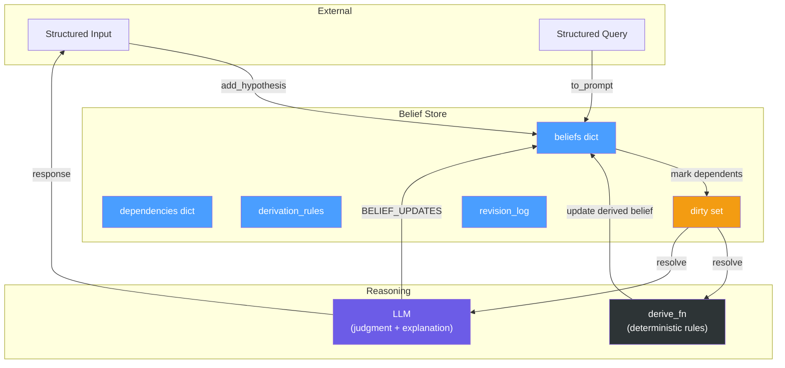
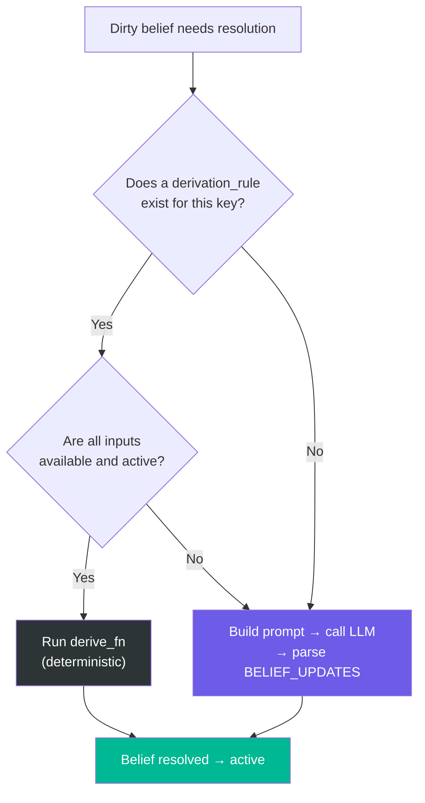
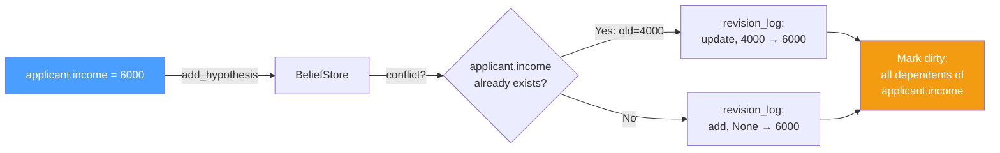
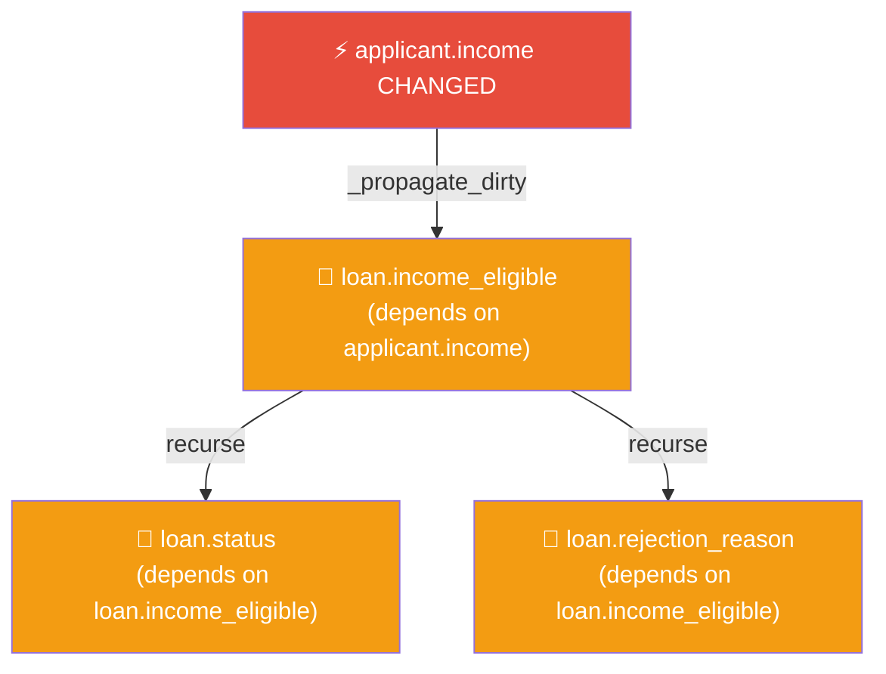
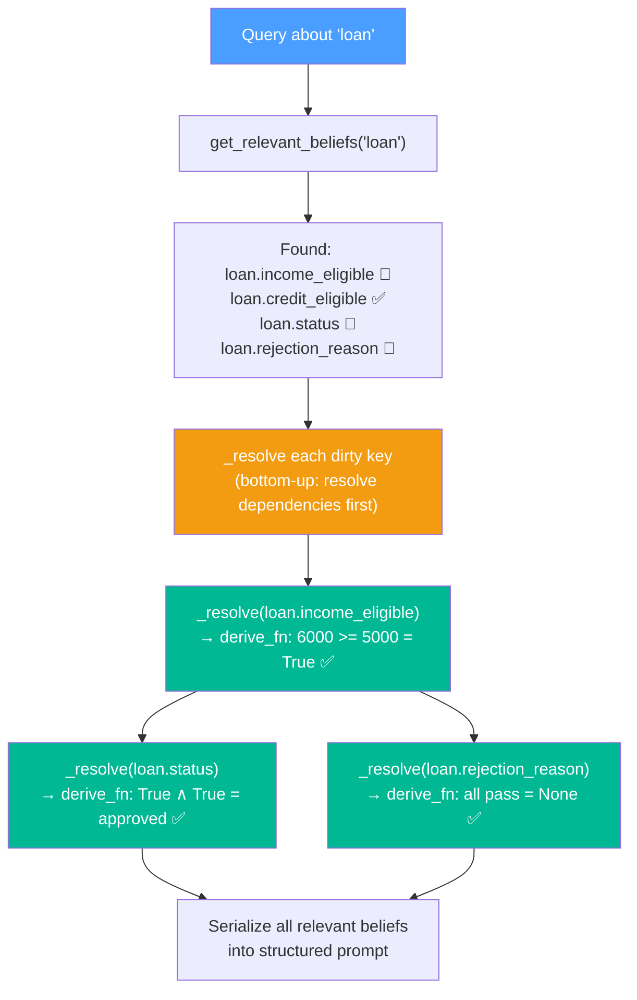
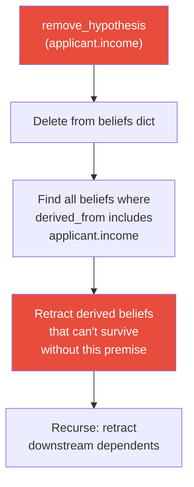
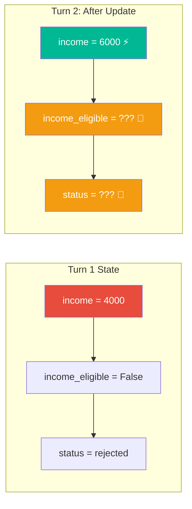
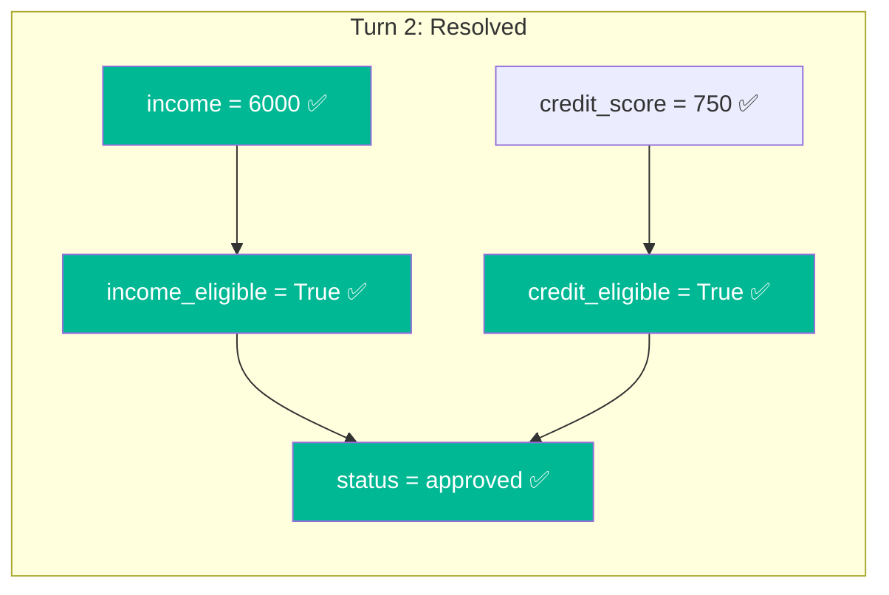

# Final Agreed Implementation

---

## System Architecture

A fixed LLM (never retrained) augmented with an external, persistent belief store. All inputs and outputs are structured. No natural language anywhere in the pipeline.



---

## Dual Derivation: derive_fn vs LLM

There are two paths for resolving a dirty belief:

| Path | When | Speed | Reliability |
|---|---|---|---|
| **`derive_fn`** | Rule is deterministic, all inputs available | Fast (no API call) | 100% — it's code |
| **LLM** | Conclusion needs reasoning, judgment, or explanation | Slow (API call) | Depends on prompt quality |



For most domain rules (threshold checks, boolean logic), `derive_fn` handles it. The LLM is called when:
- No deterministic rule exists for the key
- The query requires explanation or multi-step reasoning
- The user asks a question that spans multiple beliefs

---

## Complete Flow (Step by Step)

### Step 1: User Provides New Beliefs

```
Input: applicant.income = 6000
```



**What `add_hypothesis` does:**

```python
def add_hypothesis(self, key, value):
    old = self.beliefs.get(key)

    # Log the change
    if old is not None:
        self.revision_log.append({
            "action": "update", "key": key, "old": old, "new": value
        })
    else:
        self.revision_log.append({
            "action": "add", "key": key, "old": None, "new": value
        })

    # Store the belief
    self.beliefs[key] = value
    self.is_derived[key] = False

    # Recursively mark all dependents dirty
    self._propagate_dirty(key)
```

### Step 2: Recursive Dirty Propagation

When `applicant.income` changes, ALL downstream dependents are marked dirty — not just one level.



```python
def _propagate_dirty(self, key):
    """Recursively mark all downstream dependents as dirty."""
    for dep_key, dep_sources in self.dependencies.items():
        if key in dep_sources and dep_key not in self.dirty:
            self.dirty.add(dep_key)
            self._propagate_dirty(dep_key)  # recurse
```

### Step 3: User Provides a Query

```
[QUERY] What is the current loan status?
```

The system identifies relevant entities from the query (e.g., `loan`, `applicant`).

### Step 4: Resolve Dirty Beliefs + Serialize Prompt

`to_prompt(entities)` does two things:
1. **Resolve** any dirty keys related to queried entities
2. **Serialize** relevant beliefs into the prompt



```python
def _resolve(self, key):
    """Resolve a dirty belief by re-deriving it."""
    if key not in self.dirty:
        return

    # Resolve upstream dependencies first (bottom-up)
    for dep in self.dependencies.get(key, []):
        if dep in self.dirty:
            self._resolve(dep)

    # Try derive_fn first
    for rule in self.derivation_rules:
        if rule["output_key"] == key:
            inputs = {k: self.beliefs[k] for k in rule["inputs"]
                      if k in self.beliefs}
            if len(inputs) == len(rule["inputs"]):
                old = self.beliefs.get(key)
                new = rule["derive_fn"](inputs)
                self.beliefs[key] = new
                self.dirty.discard(key)
                self.revision_log.append({
                    "action": "derived", "key": key,
                    "old": old, "new": new,
                    "reason": f"derived by rule '{rule['name']}'"
                })
                return

    # No derive_fn available — will be resolved by LLM during prompt
    pass
```

### Step 5: Structured Prompt Sent to LLM

```
[SYSTEM]
You are a belief-aware reasoning assistant. Reason strictly
based on the provided belief state. Output any new or updated
beliefs in the BELIEF_UPDATES section.

[RELEVANT BELIEFS]
[base] applicant.income = 6000
[base] applicant.credit_score = 750
[base] loan.min_income = 5000
[base] loan.min_credit = 600
[derived] loan.income_eligible = True
[derived] loan.credit_eligible = True
[derived] loan.status = approved
[derived] loan.rejection_reason = None

[QUERY]
What is the current loan status?

[OUTPUT FORMAT]
REASONING: <step-by-step referencing belief keys>
BELIEF_UPDATES:
- key = value
```

### Step 6: LLM Responds + Updates Parsed

```
REASONING: applicant.income (6000) >= loan.min_income (5000),
so loan.income_eligible = True. applicant.credit_score (750)
>= loan.min_credit (600), so loan.credit_eligible = True.
Both checks pass, so loan.status = approved.

BELIEF_UPDATES:
(none — derive_fn already resolved all beliefs)
```

If the LLM does return `BELIEF_UPDATES`, the parser extracts them and feeds them back into the store as derived beliefs:

```python
def apply_llm_updates(self, updates, prompt_beliefs):
    """Apply BELIEF_UPDATES from LLM response."""
    for key, value in updates.items():
        old = self.beliefs.get(key)
        self.beliefs[key] = value
        self.is_derived[key] = True
        self.dirty.discard(key)

        # Infer dependencies from what was in the prompt
        self.dependencies[key] = list(prompt_beliefs.keys())

        self.revision_log.append({
            "action": "derived", "key": key,
            "old": old, "new": value,
            "reason": "derived by LLM"
        })

        # New derived value might affect downstream
        self._propagate_dirty(key)
```

### Step 7: Return Response to User

The LLM's `REASONING` section is returned as the answer. The belief store is now consistent and up-to-date.

### Step 8: Repeat

Next interaction starts from step 1 (new beliefs) or step 2 (new query). The belief store persists across turns.

---

## Belief Retraction (Pure Deletion)

When a hypothesis is removed with no replacement:



```python
def remove_hypothesis(self, key):
    """Retract a hypothesis and cascade to unsupported derivations."""
    old = self.beliefs.pop(key, None)
    self.is_derived.pop(key, None)
    self.dirty.discard(key)

    self.revision_log.append({
        "action": "retract", "key": key, "old": old, "new": None
    })

    # Cascade: retract any derived belief missing a premise
    for dep_key, dep_sources in list(self.dependencies.items()):
        if key in dep_sources:
            all_present = all(s in self.beliefs for s in dep_sources)
            if not all_present:
                self.remove_hypothesis(dep_key)  # recursive retraction
```

---

## BeliefStore Class (Complete Interface)

```python
class BeliefStore:
    def __init__(self):
        self.beliefs = {}           # key → value
        self.dependencies = {}      # key → [list of keys it depends on]
        self.is_derived = {}        # key → bool
        self.dirty = set()          # keys with unchecked upstream changes
        self.revision_log = []      # audit trail
        self.derivation_rules = []  # deterministic rules

    # === Hypothesis management ===
    def add_hypothesis(self, key, value): ...
    def remove_hypothesis(self, key): ...

    # === Derivation ===
    def _add_derived(self, key, value, depends_on): ...
    def add_rule(self, name, inputs, output_key, derive_fn): ...

    # === Dirty propagation & resolution ===
    def _propagate_dirty(self, key): ...
    def _resolve(self, key): ...

    # === Query & prompt ===
    def query(self, key): ...
    def get_relevant_beliefs(self, entity): ...
    def to_prompt(self, entities): ...

    # === LLM integration ===
    def apply_llm_updates(self, updates, prompt_beliefs): ...

    # === Audit ===
    def format_revision_log(self, since_index=0): ...
```

---

## Attribute Schemas

**`beliefs`** — `dict[str, Any]`
```
Key format:   "entity.attribute" (str)
Value format: Any (int, float, str, bool, None)

Example:
{
    "applicant.income": 6000,
    "applicant.credit_score": 750,
    "loan.min_income": 5000,
    "loan.min_credit": 600,
    "loan.income_eligible": True,
    "loan.credit_eligible": True,
    "loan.status": "approved",
    "loan.rejection_reason": None
}
```

**`dependencies`** — `dict[str, list[str]]`
```
Key:   derived belief key
Value: list of keys it depends on

Example:
{
    "loan.income_eligible": ["applicant.income", "loan.min_income"],
    "loan.credit_eligible": ["applicant.credit_score", "loan.min_credit"],
    "loan.status": ["loan.income_eligible", "loan.credit_eligible"],
    "loan.rejection_reason": ["loan.income_eligible", "loan.credit_eligible"]
}
```

**`is_derived`** — `dict[str, bool]`
```
True = derived (recomputed, never directly set by user)
False = hypothesis (set by user input)

Example:
{
    "applicant.income": False,
    "loan.income_eligible": True,
    "loan.status": True
}
```

**`dirty`** — `set[str]`
```
Keys of beliefs with unchecked upstream changes.
Cleared when _resolve(key) runs.

Example after updating applicant.income:
{"loan.income_eligible", "loan.status", "loan.rejection_reason"}
```

**`revision_log`** — `list[dict]`
```
Four action types:

Add:      {"action": "add",     "key": ..., "old": None,  "new": ...}
Update:   {"action": "update",  "key": ..., "old": ...,   "new": ...}
Derived:  {"action": "derived", "key": ..., "old": ...,   "new": ..., "reason": ...}
Retract:  {"action": "retract", "key": ..., "old": ...,   "new": None}
```

**`derivation_rules`** — `list[dict]`
```
Each rule:
{
    "name": "income_check",
    "inputs": ["applicant.income", "loan.min_income"],
    "output_key": "loan.income_eligible",
    "derive_fn": Callable[[dict], Any]
}

Example rules for loan domain:

1. income_check:
   inputs: [applicant.income, loan.min_income]
   output: loan.income_eligible
   logic:  income >= min_income

2. credit_check:
   inputs: [applicant.credit_score, loan.min_credit]
   output: loan.credit_eligible
   logic:  credit >= min_credit

3. loan_decision:
   inputs: [loan.income_eligible, loan.credit_eligible]
   output: loan.status
   logic:  "approved" if both True, else "rejected"

4. rejection_reason:
   inputs: [loan.income_eligible, loan.credit_eligible]
   output: loan.rejection_reason
   logic:  None if approved, else which check failed
```

---

## Prompt Template

```
[SYSTEM]
You are a belief-aware reasoning assistant. Reason strictly
based on the provided belief state. Output any new or updated
beliefs in the BELIEF_UPDATES section.

[RELEVANT BELIEFS]
[base] applicant.income = 6000
[base] loan.min_income = 5000
[derived] loan.income_eligible = True
...

[QUERY]
What is the current loan status?

[OUTPUT FORMAT]
REASONING: <step-by-step referencing belief keys>
BELIEF_UPDATES:
- key = value
```

---

## Key Design Principles

- **All beliefs explicit and structured.** No facts hidden in prompts or queries.
- **Lazy revision.** Dirty beliefs resolved only at query time, only for relevant entities.
- **Hypothesis vs. derived.** Only hypotheses are directly revisable. Derived beliefs are recomputed.
- **Dual derivation.** `derive_fn` for deterministic rules, LLM for judgment/explanation.
- **Minimal change.** Only downstream dependents of a changed hypothesis are touched.
- **Cascading retraction.** If a hypothesis is deleted, unsupported derived beliefs are retracted recursively.
- **Relevant injection.** Only beliefs related to the queried entities are sent to the LLM.
- **Dependency inference.** LLM-derived beliefs inherit dependencies from the prompt context.
- **Full audit trail.** Every add, update, derivation, and retraction is logged.

---

## Full Example Walkthrough

### Turn 1: Initial beliefs

```
add_hypothesis("applicant.income", 4000)
add_hypothesis("applicant.credit_score", 750)
add_hypothesis("loan.min_income", 5000)
add_hypothesis("loan.min_credit", 600)
```

Rules fire (via `derive_fn`):
```
loan.income_eligible = False  (4000 < 5000)
loan.credit_eligible = True   (750 >= 600)
loan.status = "rejected"      (not both eligible)
loan.rejection_reason = "income below minimum"
```

### Turn 2: Income updated

```
add_hypothesis("applicant.income", 6000)
```



Dirty propagation: `{loan.income_eligible, loan.status, loan.rejection_reason}`

### Turn 2: Query triggers resolution

```
query: "What is the loan status?"
→ to_prompt(["loan", "applicant"])
→ _resolve("loan.income_eligible")  →  derive_fn: 6000 >= 5000 = True
→ _resolve("loan.status")           →  derive_fn: True ∧ True = "approved"
→ _resolve("loan.rejection_reason") →  derive_fn: None (all pass)
```



Revision log:
```
[update]  applicant.income:        4000 → 6000
[derived] loan.income_eligible:    False → True   (rule: income_check)
[derived] loan.status:             rejected → approved (rule: loan_decision)
[derived] loan.rejection_reason:   "income below minimum" → None
```