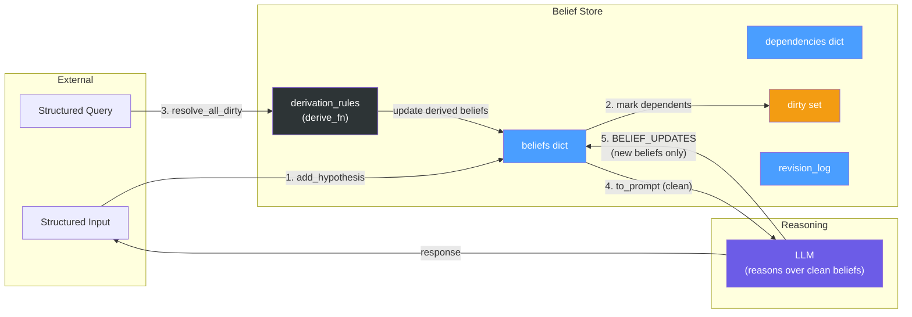
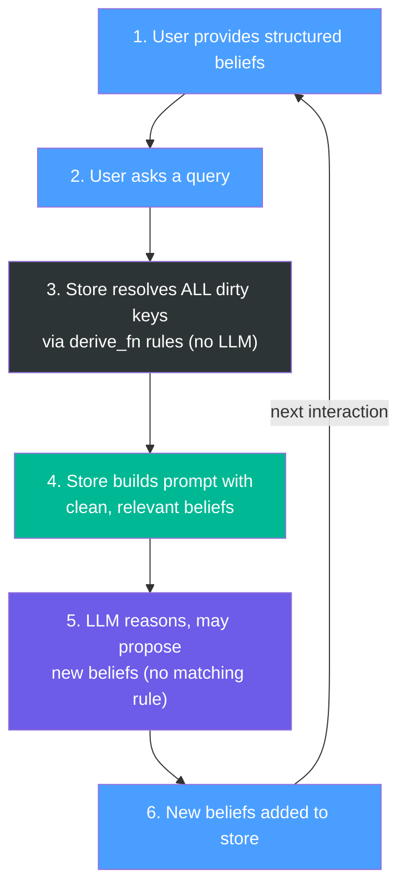
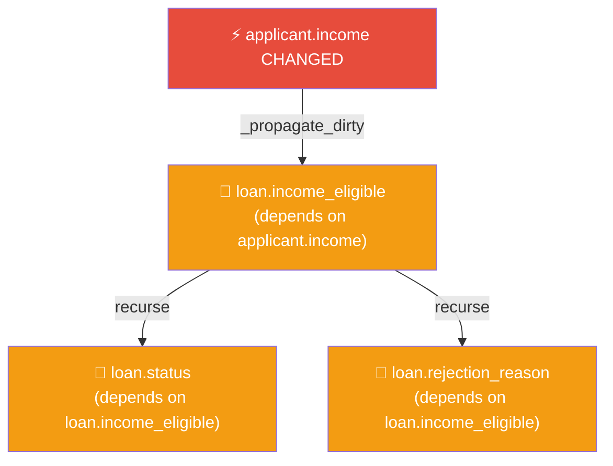
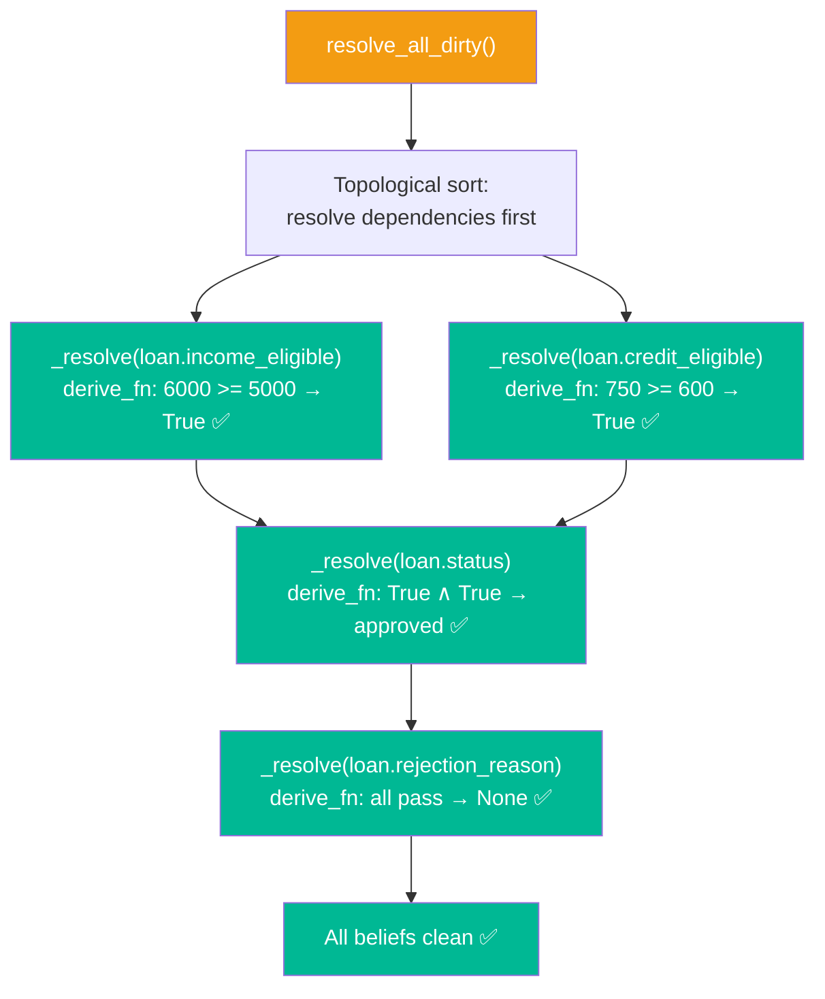
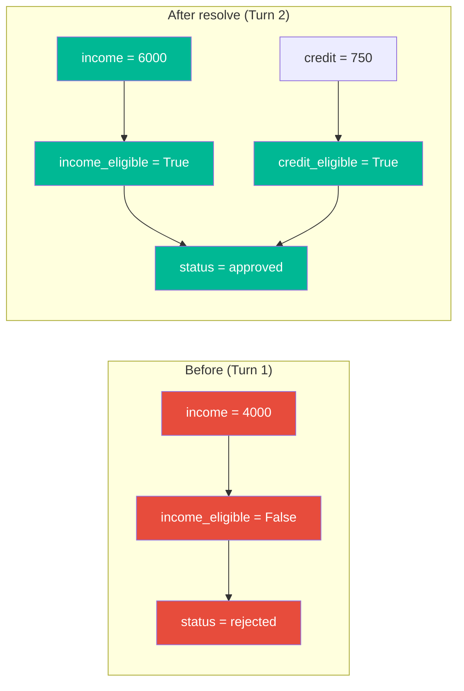

# Final Agreed Implementation

---

## System Architecture

A fixed LLM (never retrained) augmented with an external, persistent belief store. All inputs and outputs are structured. No natural language anywhere in the pipeline.



---

## The Flow



The strict separation:
- **`derive_fn` resolves all dirty beliefs BEFORE the LLM sees anything**
- **The LLM only ever sees clean, fully-resolved beliefs**
- **The LLM only proposes NEW beliefs that have no matching rule**

---

## Step 1: User Provides Structured Beliefs

```
applicant.income = 6000
applicant.credit_score = 750
```

```python
def add_hypothesis(self, key, value):
    old = self.beliefs.get(key)

    # Log
    if old is not None:
        self.revision_log.append({
            "action": "update", "key": key, "old": old, "new": value
        })
    else:
        self.revision_log.append({
            "action": "add", "key": key, "old": None, "new": value
        })

    # Store
    self.beliefs[key] = value
    self.is_derived[key] = False

    # Mark all downstream dependents dirty (recursive)
    self._propagate_dirty(key)
```

### Recursive Dirty Propagation



```python
def _propagate_dirty(self, key):
    """Recursively mark all downstream dependents as dirty."""
    for dep_key, dep_sources in self.dependencies.items():
        if key in dep_sources and dep_key not in self.dirty:
            self.dirty.add(dep_key)
            self._propagate_dirty(dep_key)
```

---

## Step 2: User Asks a Query

```
[QUERY] What is the current loan status?
```

The system identifies relevant entities (e.g., `loan`, `applicant`).

---

## Step 3: Resolve ALL Dirty Keys via Rules (No LLM)

Before the LLM sees anything, every dirty belief is resolved deterministically via `derive_fn`. Resolution is bottom-up: dependencies are resolved before their dependents.



```python
def resolve_all_dirty(self):
    """Resolve ALL dirty beliefs via derive_fn. No LLM."""
    # Resolve in dependency order (bottom-up)
    resolved = set()

    def resolve(key):
        if key in resolved or key not in self.dirty:
            return
        # Resolve upstream first
        for dep in self.dependencies.get(key, []):
            if dep in self.dirty:
                resolve(dep)

        # Find matching rule
        for rule in self.derivation_rules:
            if rule["output_key"] == key:
                inputs = {k: self.beliefs[k] for k in rule["inputs"]}
                old = self.beliefs.get(key)
                new = rule["derive_fn"](inputs)
                self.beliefs[key] = new
                self.dirty.discard(key)
                resolved.add(key)
                self.revision_log.append({
                    "action": "derived", "key": key,
                    "old": old, "new": new,
                    "reason": f"rule: {rule['name']}"
                })
                return

    for key in list(self.dirty):
        resolve(key)
```

---

## Step 4: Build Prompt with Clean, Relevant Beliefs

The prompt only contains beliefs relevant to the queried entities. Only those beliefs are checked for cleanliness — unrelated dirty beliefs in other entities are left alone.

```python
def to_prompt(self, entities):
    """Serialize relevant beliefs into structured prompt.
    Only relevant beliefs must be clean; others are ignored."""
    lines = []
    prompt_keys = []
    for key, value in self.beliefs.items():
        entity = key.split(".")[0]
        if entity in entities:
            assert key not in self.dirty, f"Relevant belief {key} is still dirty"
            tag = "derived" if self.is_derived.get(key) else "base"
            lines.append(f"[{tag}] {key} = {value}")
            prompt_keys.append(key)

    return "\n".join(lines), prompt_keys
```

Output:
```
[base] applicant.income = 6000
[base] applicant.credit_score = 750
[base] loan.min_income = 5000
[base] loan.min_credit = 600
[derived] loan.income_eligible = True
[derived] loan.credit_eligible = True
[derived] loan.status = approved
[derived] loan.rejection_reason = None
```

---

## Step 5: LLM Reasons Over Clean Beliefs

The LLM receives a fully resolved belief state. It reasons over it and may propose **new** beliefs that don't have a matching `derive_fn`.

```
[SYSTEM]
You are a belief-aware reasoning assistant. Reason strictly
based on the provided belief state. If you derive any new
conclusions not already in the beliefs, output them in
BELIEF_UPDATES.

[RELEVANT BELIEFS]
[base] applicant.income = 6000
[base] applicant.credit_score = 750
[base] loan.min_income = 5000
[base] loan.min_credit = 600
[derived] loan.income_eligible = True
[derived] loan.credit_eligible = True
[derived] loan.status = approved
[derived] loan.rejection_reason = None

[QUERY]
What is the current loan status?

[OUTPUT FORMAT]
REASONING: <step-by-step referencing belief keys>
BELIEF_UPDATES:
- key = value
```

LLM responds:
```
REASONING: applicant.income (6000) >= loan.min_income (5000),
so loan.income_eligible = True. applicant.credit_score (750)
>= loan.min_credit (600), so loan.credit_eligible = True.
Both checks pass, therefore loan.status = approved.

BELIEF_UPDATES:
- loan.interest_rate_tier = preferred
```

The LLM confirmed the existing beliefs and proposed a **new** belief (`loan.interest_rate_tier`) that has no existing rule.

---

## Step 6: New Beliefs Added to Store

The parser extracts `BELIEF_UPDATES` and adds them as derived beliefs:

```python
def apply_llm_updates(self, updates, prompt_keys):
    """Add LLM-proposed new beliefs to the store."""
    for key, value in updates.items():
        old = self.beliefs.get(key)
        self.beliefs[key] = value
        self.is_derived[key] = True
        self.dependencies[key] = prompt_keys  # inferred from prompt context
        self.revision_log.append({
            "action": "derived", "key": key,
            "old": old, "new": value,
            "reason": "derived by LLM"
        })
        self._propagate_dirty(key)
```

---

## Belief Retraction (Pure Deletion)

When a hypothesis is removed with no replacement:

```python
def remove_hypothesis(self, key):
    """Retract a hypothesis and cascade to unsupported derivations."""
    old = self.beliefs.pop(key, None)
    self.is_derived.pop(key, None)
    self.dirty.discard(key)
    self.revision_log.append({
        "action": "retract", "key": key, "old": old, "new": None
    })
    # Cascade: retract derived beliefs missing a premise
    for dep_key, dep_sources in list(self.dependencies.items()):
        if key in dep_sources:
            if not all(s in self.beliefs for s in dep_sources):
                self.remove_hypothesis(dep_key)
```

---

## BeliefStore Class (Complete Interface)

```python
class BeliefStore:
    def __init__(self):
        self.beliefs = {}           # key → value
        self.dependencies = {}      # key → [keys it depends on]
        self.is_derived = {}        # key → bool
        self.dirty = set()          # keys needing re-derivation
        self.revision_log = []      # audit trail
        self.derivation_rules = []  # deterministic rules

    # === Hypothesis management ===
    def add_hypothesis(self, key, value): ...
    def remove_hypothesis(self, key): ...

    # === Rules & derivation ===
    def add_rule(self, name, inputs, output_key, derive_fn): ...
    def _propagate_dirty(self, key): ...
    def resolve_all_dirty(self): ...

    # === Prompt construction ===
    def get_relevant_beliefs(self, entity): ...
    def to_prompt(self, entities): ...

    # === LLM integration ===
    def apply_llm_updates(self, updates, prompt_keys): ...

    # === Audit ===
    def format_revision_log(self, since_index=0): ...
```

---

## Attribute Schemas

**`beliefs`** — `dict[str, Any]`
```
Key:   "entity.attribute" (str)
Value: Any (int, float, str, bool, None)

Example:
{
    "applicant.income": 6000,
    "applicant.credit_score": 750,
    "loan.min_income": 5000,
    "loan.status": "approved"
}
```

**`dependencies`** — `dict[str, list[str]]`
```
Key:   derived belief key
Value: list of keys it depends on

Example:
{
    "loan.income_eligible": ["applicant.income", "loan.min_income"],
    "loan.status": ["loan.income_eligible", "loan.credit_eligible"]
}
```

**`is_derived`** — `dict[str, bool]`
```
True = derived (recomputed via rules or LLM, never directly set)
False = hypothesis (set by user input)
```

**`dirty`** — `set[str]`
```
Keys needing re-derivation. Cleared by resolve_all_dirty().

Example after updating applicant.income:
{"loan.income_eligible", "loan.status", "loan.rejection_reason"}
```

**`revision_log`** — `list[dict]`
```
Four action types:
  Add:      {"action": "add",     "key": ..., "old": None,  "new": ...}
  Update:   {"action": "update",  "key": ..., "old": ...,   "new": ...}
  Derived:  {"action": "derived", "key": ..., "old": ...,   "new": ..., "reason": ...}
  Retract:  {"action": "retract", "key": ..., "old": ...,   "new": None}
```

**`derivation_rules`** — `list[dict]`
```
{
    "name": "income_check",
    "inputs": ["applicant.income", "loan.min_income"],
    "output_key": "loan.income_eligible",
    "derive_fn": Callable[[dict], Any]
}

Loan domain rules:
  1. income_check:    income >= min_income → income_eligible
  2. credit_check:    credit >= min_credit → credit_eligible
  3. loan_decision:   both eligible → "approved", else "rejected"
  4. rejection_reason: None if approved, else which check failed
```

---

## Key Design Principles

- **All beliefs explicit and structured.** No facts hidden in prompts.
- **Strict flow.** Dirty beliefs resolved via rules BEFORE LLM sees anything.
- **LLM sees only clean beliefs.** No dirty or unresolved state in prompts.
- **LLM proposes, never resolves.** LLM adds new beliefs; rules resolve existing ones.
- **Hypothesis vs. derived.** Only hypotheses are directly revisable.
- **Lazy revision.** Dirty flags propagate immediately; resolution happens at query time.
- **Cascading retraction.** Deleted hypotheses cascade to unsupported derivations.
- **Full audit trail.** Every add, update, derivation, and retraction is logged.

---

## Full Example Walkthrough

### Turn 1: Initial Beliefs

```
add_hypothesis("applicant.income", 4000)
add_hypothesis("applicant.credit_score", 750)
add_hypothesis("loan.min_income", 5000)
add_hypothesis("loan.min_credit", 600)
```

Query: "What is the loan status?"
→ `resolve_all_dirty()`:
```
loan.income_eligible = False  (4000 < 5000)
loan.credit_eligible = True   (750 >= 600)
loan.status = "rejected"
loan.rejection_reason = "income below minimum"
```

### Turn 2: Income Updated

```
add_hypothesis("applicant.income", 6000)
→ dirty: {loan.income_eligible, loan.status, loan.rejection_reason}
```

Query: "What is the loan status?"
→ `resolve_all_dirty()`:



→ `to_prompt(["loan", "applicant"])` → all clean beliefs serialized
→ LLM reasons over clean state, confirms approval

Revision log:
```
[update]  applicant.income:         4000 → 6000
[derived] loan.income_eligible:     False → True    (rule: income_check)
[derived] loan.status:              rejected → approved (rule: loan_decision)
[derived] loan.rejection_reason:    "income below minimum" → None
```