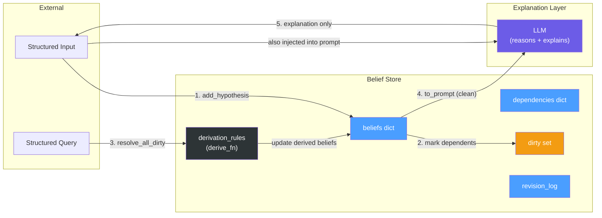
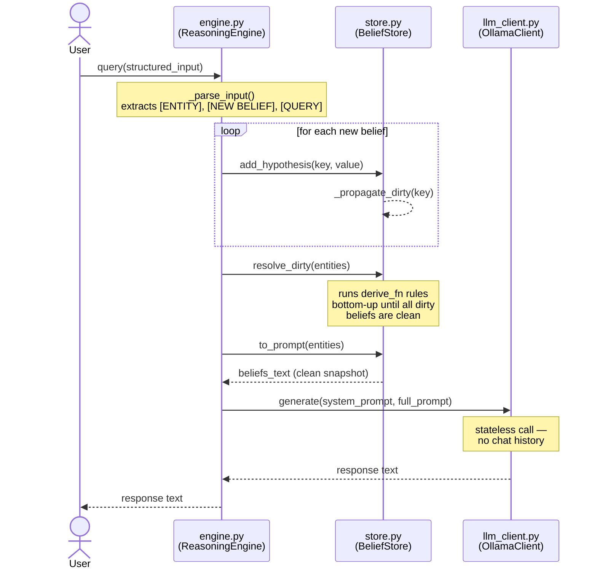
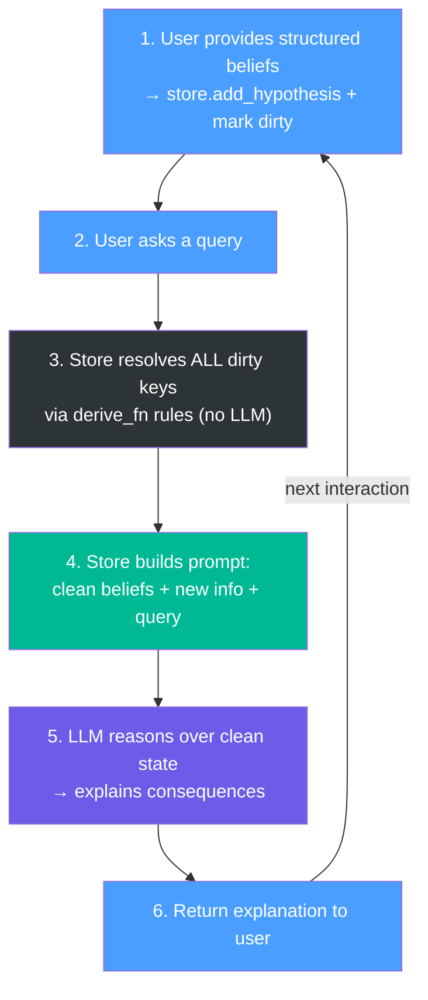
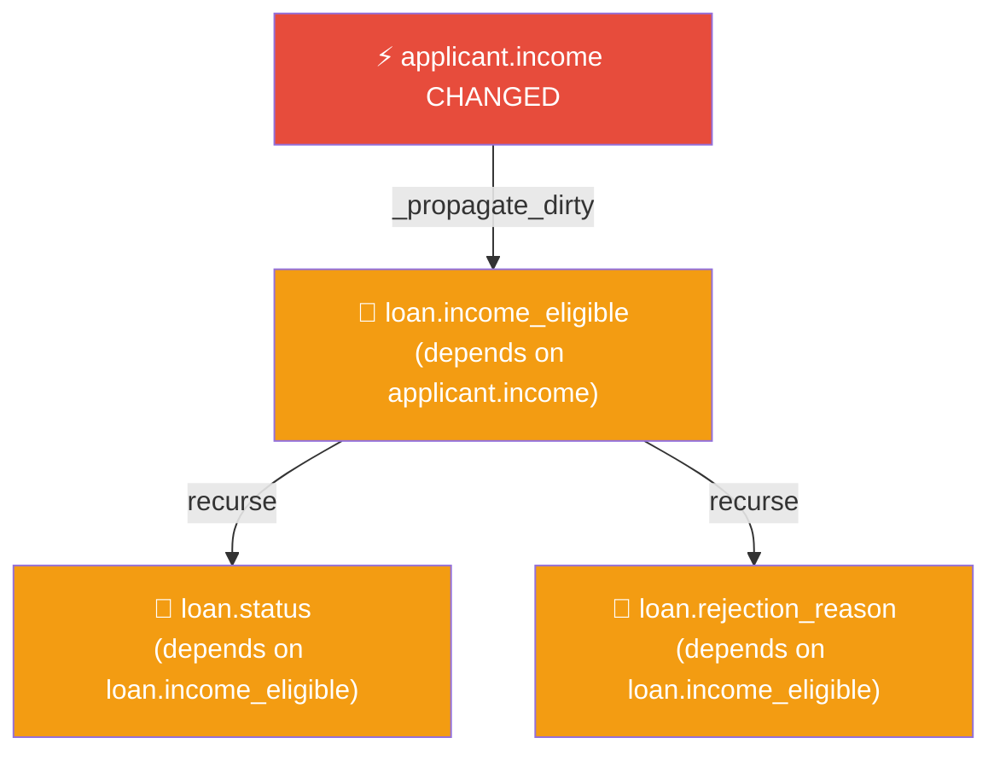
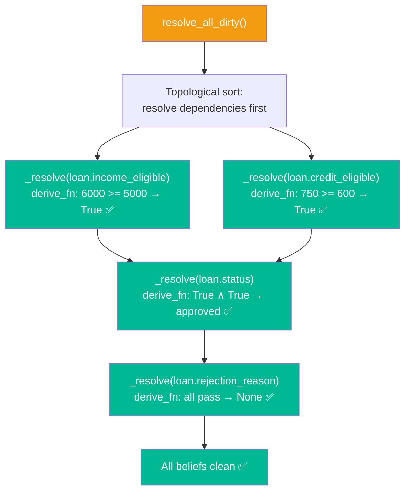

# Final Agreed Implementation

---

## System Architecture

A fixed LLM (never retrained) augmented with an external, persistent belief store. All inputs and outputs are structured. No natural language anywhere in the pipeline.



The LLM **never writes to the store**. The store is only updated from structured input + `derive_fn` rules. The LLM is the explanation layer.

---

## Module Interactions

How `engine.py`, `store.py`, and `llm_client.py` interact during a single query turn.



**Key invariants enforced by this flow:**

- `resolve_dirty` is always called **before** `to_prompt` — the LLM never sees stale beliefs
- `generate()` is stateless — every call is a fresh context window
- The store is never modified by `LLM` — it only reads via `to_prompt`

---

## The Flow



---

## Step 1: User Provides Structured Beliefs

```
applicant.income = 6000
applicant.credit_score = 750
```

```python
def add_hypothesis(self, key, value):
    old_entry = self.beliefs.get(key)
    old_value = old_entry[0] if old_entry is not None else None

    # Log
    if old_value is not None:
        self.revision_log.append({
            "action": "update", "key": key, "old": old_value, "new": value
        })
    else:
        self.revision_log.append({
            "action": "add", "key": key, "old": None, "new": value
        })

    # Store: beliefs maps key → (value, is_derived)
    # Hypotheses have is_derived = False
    self.beliefs[key] = (value, False)

    # Mark all downstream dependents dirty (recursive)
    self._propagate_dirty(key)
```

### Recursive Dirty Propagation



```python
def _propagate_dirty(self, key):
    """Recursively mark all downstream dependents as dirty using reverse adjacency."""
    for dep_key in self._dependents.get(key, []):
        if dep_key not in self.dirty:
            self.dirty.add(dep_key)
            self._propagate_dirty(dep_key)
```

---

## Step 2: User Asks a Query

```
[QUERY] What is the current loan status?
```

The system identifies relevant entities (e.g., `loan`, `applicant`).

---

## Step 3: Resolve ALL Dirty Keys via Rules (No LLM)

Before the LLM sees anything, every dirty belief is resolved deterministically via `derive_fn`. Resolution is bottom-up: dependencies are resolved before their dependents.



```python
def resolve_all_dirty(self):
    """Resolve ALL dirty beliefs via derive_fn. No LLM."""
    entity_set = {self.entity_of(k) for k in self.dirty}
    self._resolve_dirty_set(entity_set)

def _resolve_dirty_set(self, entity_set):
    """Internal resolver — operates on a pre-built entity set."""
    resolved = set()

    def resolve(key):
        if key in resolved or key not in self.dirty:
            return
        # Always resolve upstream deps (may belong to other entities)
        for dep in self.dependencies.get(key, []):
            if dep in self.dirty:
                resolve(dep)

        rule = self.rule_index.get(key)
        if not rule:
            return

        # Lazy cascade: if any input was tombstoned, tombstone this derived belief too
        if any(inp in self.removed for inp in rule["inputs"]):
            old_entry = self.beliefs.get(key)
            old_value = old_entry[0] if old_entry is not None else None
            self.removed.add(key)
            self.beliefs.pop(key, None)
            self.dirty.discard(key)
            resolved.add(key)
            return

        # Build input_values dict from beliefs
        input_values = {k: self.beliefs[k][0] for k in rule["inputs"] if k in self.beliefs}
        old_entry = self.beliefs.get(key)
        old_value = old_entry[0] if old_entry is not None else None

        # Execute derive_fn with actual input values
        new_value = rule["derive_fn"](input_values)
        self.beliefs[key] = (new_value, True)
        self.dirty.discard(key)
        resolved.add(key)

        # Store derivation trace for prompt annotations
        self.derivation_traces[key] = {
            "inputs": dict(input_values),
            "name": rule["name"],
        }

        self.revision_log.append({
            "action": "derived", "key": key,
            "old": old_value, "new": new_value,
            "reason": f"rule: {rule['name']}",
        })

    # Only resolve dirty keys that belong to the requested entities
    for key in list(self.dirty):
        resolve(key)
```

---

## Step 4: Build Prompt with Clean, Relevant Beliefs

The prompt only contains beliefs relevant to the queried entities. Only those beliefs are checked for cleanliness — unrelated dirty beliefs in other entities are left alone.

```python
def to_prompt(self, entities):
    """Serialize relevant beliefs into structured prompt.
    Only relevant beliefs must be clean; others are ignored."""
    lines = []
    prompt_keys = []

    entity_set = set(entities)
    for key, (value, is_derived) in self.beliefs.items():
        if key in self.removed:
            continue  # skip tombstoned beliefs
        entity = self.entity_of(key)
        if entity in entity_set:
            assert key not in self.dirty, f"Relevant belief {key} is still dirty"
            tag = "derived" if is_derived else "base"
            line = f"[{tag}] {key} = {value}"
            lines.append(line)
            prompt_keys.append(key)

    return "\n".join(lines), prompt_keys
```

Output:

```
[base] applicant.income = 6000
[base] applicant.credit_score = 750
[base] loan.min_income = 5000
[base] loan.min_credit = 600
[derived] loan.income_eligible = True
[derived] loan.credit_eligible = True
[derived] loan.status = approved
[derived] loan.rejection_reason = None
```

---

## Step 5: LLM Reasons Over Clean Beliefs

The LLM receives a fully resolved belief state + the new information that triggered this turn + the user's query. It explains what happened and answers the question.

```
[SYSTEM]
You are a belief-aware reasoning assistant. Reason strictly
based on the provided belief state. Explain your reasoning
step by step, referencing belief keys.

[NEW INFORMATION THIS TURN]
- applicant.income updated: 4000 → 6000

[RELEVANT BELIEFS (after update)]
[base] applicant.income = 6000
[base] applicant.credit_score = 750
[base] loan.min_income = 5000
[base] loan.min_credit = 600
[derived] loan.income_eligible = True
[derived] loan.credit_eligible = True
[derived] loan.status = approved
[derived] loan.rejection_reason = None

[QUERY]
What is the current loan status?

[OUTPUT FORMAT]
REASONING: <step-by-step referencing belief keys>
ANSWER: <direct answer to the query>
```

LLM responds:

```
REASONING: applicant.income was updated from 4000 to 6000.
This now exceeds loan.min_income (5000), so loan.income_eligible
changed from False to True. applicant.credit_score (750) still
exceeds loan.min_credit (600), so loan.credit_eligible remains
True. Both checks now pass, so loan.status changed from
"rejected" to "approved".

ANSWER: The loan is now approved. The income increase to 6000
exceeded the minimum threshold of 5000, which was the previous
reason for rejection.
```

The LLM's output is returned to the user as an explanation. **Nothing is written back to the store** — the store was already updated by `add_hypothesis` + `resolve_all_dirty` in steps 1–3.

---

## Step 6: Return Explanation to User

The LLM's reasoning and answer are returned. The belief store is consistent and fully updated. The next interaction starts from step 1.

---

## Belief Retraction (Lazy Deletion via Tombstones)

When a hypothesis is removed with no replacement, it is **immediately** added to the `removed` tombstone set but **not deleted** from `beliefs`. The actual deletion and cascading retraction are deferred until accessed or during resolution:

```python
def remove_hypothesis(self, key):
    """Lazily retract a hypothesis using tombstones.

    The key is immediately tombstoned but not flushed from beliefs.
    Actual deletion cascades lazily when resolve_dirty encounters it.
    """
    if key in self.removed:
        return  # already tombstoned

    old_entry = self.beliefs.get(key)
    old_value = old_entry[0] if old_entry is not None else None

    self.removed.add(key)  # tombstone immediately
    self.dirty.discard(key)  # no need to resolve

    self.revision_log.append({
        "action": "retract", "key": key, "old": old_value, "new": None
    })

    # Mark downstream derived beliefs dirty so resolve_dirty will cascade
    self._propagate_dirty(key)
```

**Lazy semantics:**

1. `remove_hypothesis("applicant.income")` → tombstones immediately
2. `get_value("applicant.income")` → flushes from `beliefs`
3. `resolve_dirty()` → encounters tombstone, cascades deletion to dependent derived beliefs

This defers expensive cascades until they're actually needed.

---

## BeliefStore Class (Complete Interface)

```python
class BeliefStore:
    def __init__(self):
        self.beliefs: dict[str, tuple[Any, bool]]  # key → (value, is_derived)
        self.dependencies: dict[str, list[str]]    # key → [keys it depends on]
        self._dependents: dict[str, list[str]]     # reverse: input → [outputs reading it]
        self.dirty: set[str]                       # keys needing re-derivation
        self.removed: set[str]                     # tombstone set for lazy retraction
        self.rule_index: dict[str, dict]           # output_key → {name, inputs, derive_fn}
        self.revision_log: list[dict]              # audit trail of all mutations
        self.derivation_traces: dict[str, dict]    # output_key → {inputs: {...}, name: str}
        self._entity_cache: dict[str, str]         # key → entity name (cached)

    # === Hypothesis management ===
    def add_hypothesis(self, key, value): ...
    def remove_hypothesis(self, key): ...

    # === Rules & derivation ===
    def add_rule(self, name, inputs, output_key, derive_fn): ...
    def _propagate_dirty(self, key): ...
    def resolve_all_dirty(self): ...
    def resolve_dirty(self, entities): ...

    # === Prompt construction ===
    def to_prompt(self, entities): ...
    def to_prompt_attributes(self, attributes, max_depth=3): ...
    def hopwalk(self, attributes, max_depth=3): ...

    # === Audit ===
    def format_revision_log(self, since_index=0): ...
```

---

## Internal Data Structures (Complete Reference)

### `beliefs` — `dict[str, tuple[Any, bool]]`

**Structure:** Maps belief key → (value, is_derived)

The tuple tracks both the current value and whether it's derived from a rule or a base hypothesis.

```
Key:     "entity.attribute" (str)
Value:   (actual_value: Any, is_derived: bool)

Example:
{
    "applicant.income": (6000, False),           # base hypothesis
    "applicant.credit_score": (750, False),      # base hypothesis
    "loan.min_income": (5000, False),            # base fact
    "loan.income_eligible": (True, True),        # derived: 6000 >= 5000
    "loan.status": ("approved", True),           # derived: both checks pass
}
```

**Access pattern:**

```python
entry = store.beliefs.get(key)
if entry is not None:
    value, is_derived = entry
```

---

### `dependencies` — `dict[str, list[str]]`

**Structure:** Maps derived belief key → list of keys it depends on

Used for bottom-up topological resolution and tracing.

```
Key:   derived belief key
Value: list of input keys required to compute it

Example:
{
    "loan.income_eligible": ["applicant.income", "loan.min_income"],
    "loan.credit_eligible": ["applicant.credit_score", "loan.min_credit"],
    "loan.status": ["loan.income_eligible", "loan.credit_eligible"],
}
```

---

### `_dependents` — `dict[str, list[str]]`

**Structure:** Reverse adjacency map: input key → output keys that read it

Used for **O(edges) dirty propagation** instead of full graph scan.

```
Key:   any belief key (input)
Value: list of keys that depend on it (outputs)

Example:
{
    "applicant.income": ["loan.income_eligible", "loan.status"],
    "loan.income_eligible": ["loan.status"],
    "loan.credit_eligible": ["loan.status"],
}
```

When `applicant.income` changes, `_propagate_dirty` uses this map to mark only its direct dependents dirty, then recursively mark their dependents, avoiding a full graph scan.

---

### `dirty` — `set[str]`

**Structure:** Set of keys needing re-derivation

Marked by `_propagate_dirty` and cleared by `resolve_all_dirty` / `resolve_dirty`.

```
Example after updating applicant.income:
{
    "loan.income_eligible",
    "loan.status",
    "loan.rejection_reason"
}
```

---

### `removed` — `set[str]`

**Structure:** Tombstone set for lazy retraction

When `remove_hypothesis(key)` is called, the key is **immediately** added to `removed` but **not deleted** from `beliefs`. This defers the cascading deletion until:

- `get_value(key)` accesses it and flushes it, or
- `resolve_dirty` encounters it as a missing input and cascades the retraction

```
Example:
{
    "applicant.employment_status",  # retracted but not yet flushed
    "loan.employment_check",        # will be marked dirty and retracted on resolve
}
```

---

### `rule_index` — `dict[str, dict[str, Any]]`

**Structure:** Maps output key → rule definition

```
{
    "loan.income_eligible": {
        "name": "income_check",
        "inputs": ["applicant.income", "loan.min_income"],
        "derive_fn": Callable[[dict], Any]
    },
    "loan.status": {
        "name": "loan_decision",
        "inputs": ["loan.income_eligible", "loan.credit_eligible"],
        "derive_fn": Callable[[dict], Any]
    }
}
```

---

### `derivation_traces` — `dict[str, dict[str, Any]]`

**Structure:** Maps output key → {inputs: {...}, name: str}

Populated **during** `resolve_all_dirty`. Stores the **actual input values** used to compute each derived fact.

Used by `to_prompt_attributes` to inline evidence annotations without re-traversing the graph.

```
Example after resolution:
{
    "loan.income_eligible": {
        "inputs": {
            "applicant.income": 6000,
            "loan.min_income": 5000,
        },
        "name": "income_check"
    },
    "loan.status": {
        "inputs": {
            "loan.income_eligible": True,
            "loan.credit_eligible": True,
        },
        "name": "loan_decision"
    }
}
```

When serializing the prompt, instead of showing the full ancestral tree for `loan.status`, it can inline:

```
[derived] loan.status = "approved"  (evidence: loan.income_eligible=True, loan.credit_eligible=True)
```

---

### `revision_log` — `list[dict[str, Any]]`

**Structure:** Audit trail of all mutations

Four action types:

```
Add:     {"action": "add",     "key": ..., "old": None, "new": ...}
Update:  {"action": "update",  "key": ..., "old": ...,  "new": ...}
Derived: {"action": "derived", "key": ..., "old": ...,  "new": ..., "reason": ...}
Retract: {"action": "retract", "key": ..., "old": ...,  "new": None}
```

---

### `_entity_cache` — `dict[str, str]`

**Structure:** Caches entity name extraction from belief keys

Optimization to avoid repeated string splitting on `key.split(".")[0]`.

```
Example:
{
    "applicant.income": "applicant",
    "loan.status": "loan",
    "loan.credit_score": "loan",
}
```

---

## Attribute Schemas (Corrected)

---

## Key Design Principles

- **All beliefs explicit and structured.** No facts hidden in prompts.
- **Strict flow.** Dirty beliefs resolved via rules BEFORE LLM sees anything.
- **LLM sees only clean beliefs.** No dirty or unresolved state in prompts.
- **Hypothesis vs. derived.** Only hypotheses are directly revisable.
- **Lazy revision.** Dirty flags propagate immediately; resolution happens at query time.
- **Cascading retraction.** Deleted hypotheses cascade to unsupported derivations.
- **Full audit trail.** Every add, update, derivation, and retraction is logged.

---

## HopWalker and Prompt Construction

The system restricts the LLM's context window by only showing the relevant segment of the belief graph, isolating its reasoning to the exact nodes involved in the query. This is achieved using the `HopWalker` algorithm:

1. **Target Selection**: The module identifies rule inputs (`attributes`) required to evaluate the current scenario.
2. **Reverse Traversal**: `HopWalker` performs a reverse traversal of the dependency graph, tracing backwards from target attributes through their connected rules (`rule_index`) up to the base facts.
3. **Graph Pruning**: To save tokens and avoid unneeded complexity, `HopWalker` prunes traversal at any intermediate node that is already clean (i.e. not dirty). Instead of displaying the clean node's full ancestral tree, it leverages the `derivation_traces` cached during the `resolve_all_dirty` phase to inject an inline summary: `(evidence: a=1, b=2)`. Dirty nodes, however, are always fully expanded regardless of depth.
4. **Depth Capping**: A `max_depth` parameter acts as a secondary safety net to prevent infinite or runaway traversals in exceptionally deep graphs.
5. **Prompt Grouping**: The collected `HopNode` objects are mapped by depth, sorting from highest depth (root facts) down to depth 0 (targets). They are serialized into distinct sections (`# Root facts`, `# Intermediate derivations`, `# Target beliefs`) so the LLM processes them in top-down chronological sequence.
