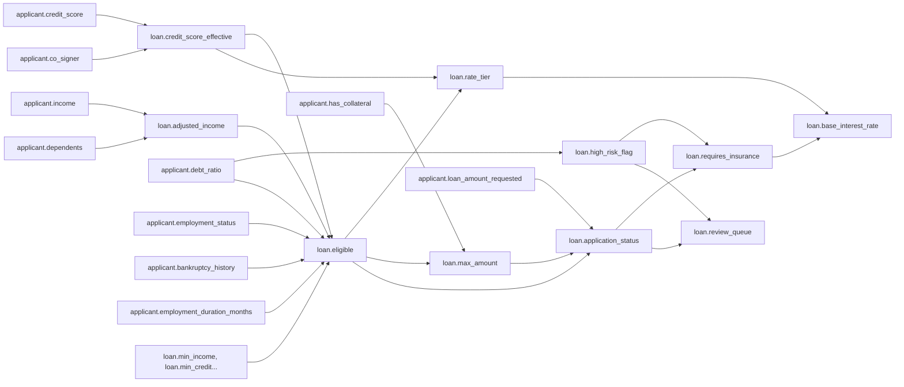

# Belief-Aware LLM — Domain Specifications

This document defines the four handcrafted domains used to evaluate the belief revision system. Each domain uses the KV store + dependency map representation (`entity.attribute = value`). Rules are deterministic `derive_fn` functions.

---

## Domain 1: Loan Eligibility

### Purpose

The **baseline domain**. Threshold-based rules with clear pass/fail outcomes. Validates core architecture: insert, conflict detection, dirty propagation, lazy resolution.

### What It Tests

| Capability | How |
|---|---|
| Basic contradiction detection | Income changes → old value conflicts with new |
| Multi-hop revision | Income → adjusted_income → eligible → rate_tier (3 hops) |
| Conjunctive rules | Eligibility requires ALL conditions in one rule |
| Belief Maintain | Changing credit score should NOT affect employment status |
| Stage-gated decisions | Distinguishing global eligibility (qualified applicant) from application-specific decisions (amount requested vs maximum allowed) |

### Attributes (KV Keys)

| Key | Type | Example | How It Evolves |
|---|---|---|---|
| `applicant.income` | numeric | 3000, 6000 | Raises, job loss |
| `applicant.credit_score` | numeric | 520, 750 | Payments, defaults |
| `applicant.debt_ratio` | float | 0.15, 0.60 | New loans, payoffs |
| `applicant.employment_status` | str | employed, unemployed | Hiring, firing |
| `applicant.employment_duration_months` | numeric | 3, 36 | Time passing |
| `applicant.has_collateral` | bool | true, false | Asset purchase/sale |
| `applicant.loan_amount_requested` | numeric | 10000, 50000 | Applicant changes |
| `applicant.bankruptcy_history` | bool | true, false | Proceedings resolved |
| `applicant.co_signer` | bool | true, false | Co-signer agrees/withdraws |
| `applicant.dependents` | numeric | 0, 3 | Family changes |
| `loan.min_income` | numeric | 5000 | Policy |
| `loan.min_credit` | numeric | 650 | Policy |
| `loan.max_debt_ratio` | float | 0.4 | Policy |
| `loan.adjusted_income` | numeric | 2500, 5500 | Formula changes |
| `loan.requires_insurance` | bool | true, false | Risk profile |
| `loan.review_queue` | str | auto_approve, manual_review | Automation |
| `loan.base_interest_rate` | float | 4.5, 6.5 | Rate tiers |

### Rules

All conditions are consolidated per output key — no rule priority conflicts.

```
R1: loan.eligible
    inputs: [loan.adjusted_income, loan.credit_score_effective, applicant.debt_ratio,
             applicant.employment_status, applicant.bankruptcy_history,
             applicant.employment_duration_months,
             loan.min_income, loan.min_credit, loan.max_debt_ratio]
    logic:
      IF employment_status = "unemployed" → False
      IF bankruptcy_history = True AND employment_duration_months < 24 → False
      IF adjusted_income >= min_income AND credit_score_effective >= min_credit AND debt_ratio < max_debt_ratio → True
      ELSE → False

R2: loan.credit_score_effective
    inputs: [applicant.credit_score, applicant.co_signer]
    logic:  credit_score + 50 if co_signer = True, else credit_score

R3: loan.rate_tier
    inputs: [loan.eligible, loan.credit_score_effective]
    logic:
      IF NOT eligible → None
      IF credit_score_effective >= 750 → "preferred"
      ELSE → "standard"

R4: loan.max_amount
    inputs: [loan.eligible, applicant.has_collateral]
    logic:
      IF NOT eligible → 0
      IF has_collateral → 100000
      ELSE → 30000

R5: loan.application_status
    inputs: [loan.eligible, applicant.loan_amount_requested, loan.max_amount]
    logic:
      IF NOT eligible → "denied_ineligible"
      IF loan_amount_requested > max_amount → "denied_amount_exceeded"
      ELSE → "approved"

R6: loan.high_risk_flag
    inputs: [applicant.debt_ratio]
    logic:  debt_ratio >= 0.3 → True, else False

R7: loan.adjusted_income
    inputs: [applicant.income, applicant.dependents]
    logic: income - (dependents * 500)

R8: loan.requires_insurance
    inputs: [loan.high_risk_flag, loan.application_status]
    logic: IF high_risk_flag = True AND application_status = "approved" → True, ELSE False

R9: loan.review_queue
    inputs: [loan.application_status, loan.high_risk_flag]
    logic:
      IF application_status = "approved" AND high_risk_flag = False → "auto_approve"
      IF application_status = "approved" AND high_risk_flag = True → "manual_review"
      ELSE → "rejected"

R10: loan.base_interest_rate
    inputs: [loan.rate_tier, loan.requires_insurance]
    logic:
      IF rate_tier is None → None
      base = 4.5 if rate_tier = "preferred" else 6.5
      return base + 1.0 if requires_insurance = True else base
```

### Dependency Chain



### Example Revision Scenario

```
t=0: applicant.income = 3000, applicant.dependents = 2, applicant.credit_score = 700, applicant.debt_ratio = 0.3
     → R7: 3000 - (2 * 500) → loan.adjusted_income = 2000
     → R1: 2000 < 5000 → loan.eligible = False
     → R3: not eligible → loan.rate_tier = None
     → R5: → loan.application_status = "denied_ineligible"

t=1: applicant.income updated to 6000
     → dirty: {loan.eligible, loan.rate_tier, loan.max_amount, loan.application_status}

t=2: resolve_all_dirty():
     → R7: 6000 - 1000 = 5000
     → R1: 5000 >= 5000 ✓, credit_score_effective=700 >= 650 ✓, 0.3 < 0.4 ✓ → loan.eligible = True
     → R3: eligible, credit_score_effective=700 < 750 → loan.rate_tier = "standard"
     → R4: eligible, no collateral → loan.max_amount = 30000
     → R5: eligible, 10000 <= 30000 → loan.application_status = "approved"
```

---

## Domain 2: Zylosian Xenomedicine

### Purpose

The **high-stakes safety domain**. It evaluates the system's ability to handle "Hard Stop" constraints where specific combinations of attributes result in catastrophic failure (lethal reactions). It tests the navigation of a prioritized fallback list and the recognition of non-lethal side effects when "Last Resort" protocols are triggered. The setting of this domain is an intergalactic clinic, providing treatments for various alien species.

### What It Tests

| Capability | How |
|---|---|
| **Zero Parametric Leakage** | Fictional species and compounds ensure no reliance on training data. |
| **Safety-First Retraction** | Retracting a primary treatment immediately when a "Lethal" pairing is identified. |
| **Triangulated Dependency** | Atmosphere affects both the patient (integrity) and the treatment (phase). |
| **Hierarchical Recovery** | Navigating a preference order (Primary → Secondary → Tertiary) based on safety flags. |
| **Side-Effect Propagation** | Updating patient state (e.g., sensory status) when forced to use fallback options. |

### Attributes (KV Keys)

| Key | Type | Example | How It Evolves |
|---|---|---|---|
| `patient.organism_type` | str | Sylph, Golem, Xylid | Genetic identification |
| `patient.organ_integrity` | str | stable, brittle, volatile | Derived from pressure (R1) |
| `patient.sensory_status` | str | normal, telepathic | Derived from side effects (R5) |
| `atmosphere.ambient_pressure` | numeric | 0.8, 4.5 | Environmental sensors |
| `atmosphere.dominant_gas` | str | neon, methane, xenon | Environmental sensors |
| `treatment.primary_option` | str | Aether-7 | Protocol A |
| `treatment.secondary_option` | str | Veda-12 | Protocol B |
| `treatment.tertiary_option` | str | Core-Solvent | Protocol C |
| `treatment.active_prescription` | str | Aether-7, Core-Solvent | Derived selection (R4) |
| `treatment.molecular_phase` | str | crystalline, vapor, plasma | Derived from gas (R2) |
| `medical.hazard_primary` | str | safe, LETHAL | Safety check for Plan A |
| `medical.hazard_secondary` | str | safe, LETHAL | Safety check for Plan B |
| `medical.hazard_tertiary` | str | safe, LETHAL | Safety check for Plan C |

### Rules

```python
R1: patient.organ_integrity
    inputs: [atmosphere.ambient_pressure, patient.organism_type]
    logic:
      IF ambient_pressure > 4.0 AND organism_type == "Sylph" → "volatile"
      IF ambient_pressure > 3.0 → "brittle"
      ELSE → "stable"

R2: treatment.molecular_phase
    inputs: [atmosphere.dominant_gas, treatment.active_prescription]
    logic:
      IF dominant_gas == "methane" → "plasma"
      IF dominant_gas == "xenon" AND active_prescription == "Veda-12" → "vapor"
      ELSE → "crystalline"

R3: medical.hazard_check (Calculated for each option)
    inputs: [patient.organism_type, active_compound, 
             treatment.molecular_phase, patient.organ_integrity]
    logic:
      # THE "EXPLODE" CONSTRAINTS (Deterministic Invalidation)
      IF organism_type == "Sylph" AND active_compound == "Aether-7" → "LETHAL"
      IF organism_type == "Golem" AND active_compound == "Veda-12" → "LETHAL"
      IF organism_type == "Xylid" AND active_compound == "Core-Solvent" → "LETHAL"
      
      # State-Based Hazards
      IF molecular_phase == "plasma" AND active_compound == "Veda-12" → "LETHAL"
      
      # Condition-Based Hazards
      IF organ_integrity == "volatile" AND active_compound != "none" → "LETHAL"
      ELSE → "safe"

R4: treatment.active_prescription
    inputs: [medical.hazard_primary, medical.hazard_secondary, medical.hazard_tertiary,
             treatment.primary_option, treatment.secondary_option, treatment.tertiary_option]
    logic:
      IF medical.hazard_primary == "safe" → primary_option
      IF medical.hazard_secondary == "safe" → secondary_option
      IF medical.hazard_tertiary == "safe" → tertiary_option
      ELSE → "none"

R5: patient.sensory_status
    inputs: [treatment.active_prescription, treatment.tertiary_option]
    logic:
      # Side effect of the "Last Resort" treatment
      IF active_prescription == tertiary_option → "telepathic"
      ELSE → "normal"
```
## Domain 3: Crime Scene Investigation

### Purpose

Tests **deep revision chains** and **cascading retraction**. All facts are fictional — the LLM has **zero parametric knowledge** and must rely entirely on the belief store.

### What It Tests

| Capability | How |
|---|---|
| Deep revision chains (3-4 hops) | Witness unreliable → alibi broken → suspect status → case theory |
| Complete parametric isolation | Crime is fictional — LLM can't cheat |
| Cascading retraction | Clearing a suspect retracts all downstream derivations |
| Evidence overriding testimony | CCTV (hard evidence) overrides witness (soft evidence) |

### Attributes (KV Keys)

| Key | Type | Example | How It Evolves |
|---|---|---|---|
| `suspect_a.alibi` | str | confirmed, unconfirmed, broken | Witnesses change |
| `suspect_a.alibi_source` | str | witness_jones, cctv | Source tracking |
| `suspect_a.evidence_at_scene` | str | present, absent | Forensics arrive |
| `suspect_a.motive` | str | financial, personal, none | Background investigation |
| `suspect_a.access_to_weapon` | bool | true, false | Investigation findings |
| `suspect_a.physical_evidence_match` | bool | true, false | Lab results |
| `suspect_b.alibi` | str | confirmed, broken | Same as above |
| `suspect_b.evidence_at_scene` | str | present, absent | |
| `suspect_b.motive` | str | revenge, none | |
| `case.time_of_death` | str | 10pm, 9pm | Autopsy updates |
| `case.cause_of_death` | str | blunt_force, poison | Forensics refinement |
| `case.initial_forensic_conclusion` | str | blunt_force, undetermined | Forensics initial |
| `case.cctv_available` | bool | true, false | Footage discovered |
| `case.toxicology_result` | str | positive_X, negative, pending | Lab processing |
| `witness_jones.credibility` | str | reliable, unreliable | Cross-examination |
| `suspect_a.physical_evidence_match` | bool | true, false | Forensics lab |
| `suspect_b.physical_evidence_match` | bool | true, false | Forensics lab |

### Rules

```
R1: suspect_a.status
    inputs: [suspect_a.evidence_at_scene, suspect_a.alibi,
             suspect_a.motive, suspect_a.access_to_weapon, suspect_a.cleared_by_weapon]
    logic:
      IF alibi = "confirmed" OR cleared_by_weapon = True → "cleared"
      IF evidence_at_scene = "present" AND alibi = "broken" → "prime_suspect"
      IF motive != "none" AND alibi = "broken" → "person_of_interest"
      ELSE → "under_investigation"

R2: suspect_a.alibi (derived override)
    inputs: [suspect_a.alibi_source, witness_jones.credibility, case.cctv_available]
    logic:
      IF alibi_source = "cctv" AND cctv_available = True → "confirmed"
      IF alibi_source = "witness_jones" AND credibility = "unreliable" → "broken"
      IF alibi_source = "witness_jones" AND credibility = "reliable" → "confirmed"
      ELSE → "unconfirmed"

R3: suspect_a.cleared_by_weapon
    inputs: [case.cause_of_death, suspect_a.access_to_weapon]
    logic:
      IF cause_of_death = "poison" AND access_to_weapon = False
        → True (suspect cleared for this reason)
      ELSE → False

R4: case.theory
    inputs: [suspect_a.status, suspect_a.motive]
    logic:
      IF status = "prime_suspect" AND motive = "financial"
        → "suspect_a committed crime for financial gain"
      IF status = "prime_suspect"
        → "suspect_a is primary suspect, motive under investigation"
      ELSE → "no confirmed theory"

R5: case.cause_of_death (derived override)
    inputs: [case.toxicology_result, case.initial_forensic_conclusion]
    logic:
      IF toxicology_result = "positive_X" → "poison"
      ELSE → initial_forensic_conclusion

R6: suspect_b.status
    inputs: [suspect_b.evidence_at_scene, suspect_b.alibi, suspect_b.motive]
    logic:  (same pattern as R1 for suspect_b)

R8: suspect_a.forensic_match
    inputs: [suspect_a.evidence_at_scene, suspect_a.physical_evidence_match]
    logic: IF evidence_at_scene = "present" AND physical_evidence_match = True → True, ELSE False

R9: suspect_b.forensic_match
    inputs: [suspect_b.evidence_at_scene, suspect_b.physical_evidence_match]
    logic: IF evidence_at_scene = "present" AND physical_evidence_match = True → True, ELSE False

R10: case.primary_suspect
    inputs: [suspect_a.status, suspect_b.status, suspect_a.forensic_match, suspect_b.forensic_match]
    logic:
      IF status = "prime_suspect" AND suspect_a.forensic_match = True → "suspect_a"
      IF status = "prime_suspect" AND suspect_b.forensic_match = True → "suspect_b"
      ELSE → "none"
```

### Dependency Chain (4-hop)

```
witness_jones.credibility ──→ suspect_a.alibi ──→ suspect_a.status ──→ case.theory
suspect_a.evidence_at_scene ──→                                           │
suspect_a.motive ──────────────────────────────────────────────────────────┘

case.toxicology_result ──→ case.cause_of_death ──→ suspect_a.cleared_by_weapon
```

### Example Revision Scenario

```
t=0: witness_jones says suspect_a was at bar at 10pm
     → suspect_a.alibi = "confirmed", alibi_source = "witness_jones"
     → R1: alibi confirmed → suspect_a.status = "cleared"

t=1: Cross-examination reveals jones has prior relationship with suspect_a
     → witness_jones.credibility = "unreliable"
     → dirty: {suspect_a.alibi, suspect_a.status, case.theory}

t=2: resolve_all_dirty():
     → R2: alibi_source = jones, credibility = unreliable → alibi = "broken"
     → R1: evidence = present, alibi = broken → status = "prime_suspect"
     → R4: prime_suspect, motive = financial → theory updated

t=3: Forensics: suspect_a.evidence_at_scene = "present"
     (already present — no change, no cascade)

t=4: Toxicology: case.toxicology_result = "positive_X"
     → dirty: {case.cause_of_death, suspect_a.cleared_by_weapon}
     → R5: cause_of_death = "poison"
     → R3: poison + access_to_weapon = False → cleared_by_weapon = True
```

---

## Domain 4: Thorncrester Taxonomy (Fictional Bird Species)

### Purpose

Tests belief revision with **complete parametric isolation**. The Thorncrester is fictional — the LLM has zero prior knowledge. Also tests classification revision from evolving field observations.

### What It Tests

| Capability | How |
|---|---|
| Zero parametric leakage | Fictional species — LLM cannot rely on training data |
| Classification revision | Diet reclassification cascades to prey + conservation |
| Seasonal lifecycle changes | Season change triggers behavioral and habitat updates |
| Extensibility | Easy to add new observations over time |

### Species Background

The **Thorncrester** (*Spinocristatus fictus*) is a fictional bird native to the Verath Archipelago. Two subspecies: **Coastal** and **Highland**.

### Attributes (KV Keys)

| Key | Type | Example | How It Evolves |
|---|---|---|---|
| `thorncrester.diet` | str | carnivore, omnivore, herbivore | Field reclassification |
| `thorncrester.can_fly` | bool | true, false | Life stage |
| `thorncrester.habitat` | str | coastal, highland, wetland | Derived (R3) |
| `thorncrester.subspecies` | str | coastal, highland | Identification |
| `thorncrester.life_stage` | str | juvenile, adult, elder | Maturation |
| `thorncrester.season` | str | mating, nesting, migration, dormant | Calendar |
| `thorncrester.plumage_color` | str | crimson, blue, moulted | Seasonal moult |
| `thorncrester.threat_level` | str | safe, endangered, critical | Population surveys |
| `thorncrester.population_count` | numeric | 50, 500 | Census |
| `thorncrester.nesting_behavior` | str | ground, cliff, tree | Research findings |
| `thorncrester.social_structure` | str | solitary, pair, flock | Season + context |
| `thorncrester.temperature_band` | str | cold, temperate, hot | Climate |
| `thorncrester.migration_route` | str | northern, southern, standard | Geolocator tags |

### Rules

```
R1: thorncrester.primary_prey
    inputs: [thorncrester.diet, thorncrester.habitat]
    logic:
      IF diet = "carnivore" AND habitat = "coastal" → "fish"
      IF diet = "carnivore" AND habitat = "highland" → "small_rodents"
      IF diet = "herbivore" → None  (herbivores don't have prey)
      IF diet = "omnivore" AND habitat = "coastal" → "mixed_fish_berries"
      IF diet = "insectivore" → "beetles"
      ELSE → "unknown"

R2: thorncrester.can_fly
    inputs: [thorncrester.life_stage]
    logic:
      IF life_stage = "juvenile" → False
      IF life_stage = "adult" OR life_stage = "elder" → True

R3: thorncrester.habitat (default from subspecies)
    inputs: [thorncrester.subspecies, thorncrester.season]
    logic:
      IF season = "migration" AND subspecies = "coastal" → "wetland"
      IF subspecies = "coastal" → "coastal"
      IF subspecies = "highland" → "highland"
    NOTE: season change away from migration automatically reverts habitat

R4: thorncrester.territorial_behavior
    inputs: [thorncrester.plumage_color, thorncrester.season]
    logic:  plumage_color = "crimson" AND season = "mating" → True, else False

R5: thorncrester.threat_level
    inputs: [thorncrester.population_count]
    logic:
      IF population_count < 100 → "critical"
      IF population_count < 500 → "endangered"
      ELSE → "safe"

R6: thorncrester.conservation_action
    inputs: [thorncrester.threat_level, thorncrester.habitat]
    logic:
      IF threat_level = "critical" AND habitat = "coastal" → "breeding_program"
      IF threat_level = "critical" → "emergency_monitoring"
      IF threat_level = "endangered" → "monitoring"
      ELSE → "none"

R7: thorncrester.predation_risk
    inputs: [thorncrester.nesting_behavior, thorncrester.threat_level]
    logic:
      IF nesting_behavior = "ground" AND threat_level in ("endangered", "critical")
        → "high"
      ELSE → "low"

R8: thorncrester.clutch_size
    inputs: [thorncrester.season, thorncrester.threat_level]
    logic:
      IF season = "nesting" AND threat_level in ("endangered", "critical") → 4
      IF season = "nesting" → 2
      ELSE → 0  (not nesting season)

R9: thorncrester.social_structure
    inputs: [thorncrester.territorial_behavior, thorncrester.season]
    logic:
      IF territorial_behavior = True → "pair"
      IF season = "migration" → "flock"
      ELSE → "solitary"

R10: thorncrester.migration_route
    inputs: [thorncrester.season, thorncrester.habitat, thorncrester.temperature_band]
    logic:
      IF season = "migration" AND habitat = "coastal" AND temperature_band = "cold" → "southern"
      IF season = "migration" AND habitat = "highland" AND temperature_band = "hot" → "northern"
      ELSE → "standard"
```

### Dependency Chain

```
thorncrester.diet ──→ thorncrester.primary_prey
thorncrester.habitat ──→

thorncrester.population_count ──→ thorncrester.threat_level ──→ thorncrester.conservation_action
                                                              ──→ thorncrester.predation_risk
                                                              ──→ thorncrester.clutch_size

thorncrester.season ──→ thorncrester.habitat ──→ thorncrester.primary_prey
                     ──→ thorncrester.territorial_behavior ──→ thorncrester.social_structure
                     ──→ thorncrester.clutch_size
```

### Example Revision Scenario

```
t=0: diet = "carnivore", habitat = "coastal", population_count = 800
     → R1: primary_prey = "fish"
     → R5: threat_level = "safe"
     → R6: conservation_action = "none"

t=1: Field observation: diet reclassified to "omnivore"
     → dirty: {primary_prey}
     → resolve: R1 → primary_prey = "mixed_fish_berries"

t=2: Census: population_count = 80
     → dirty: {threat_level, conservation_action, predation_risk, clutch_size}
     → resolve:
       R5 → threat_level = "critical"
       R6 → critical + coastal → conservation_action = "breeding_program"
       R7 → nesting=ground + critical → predation_risk = "high"

t=3: Season changes to "migration"
     → dirty: {habitat, territorial_behavior, social_structure, clutch_size}
     → resolve:
       R3 → migration + coastal → habitat = "wetland"
       → habitat changed → primary_prey dirty → R1 re-derives
       R4 → not mating season → territorial = False
       R9 → migration → social_structure = "flock"

t=4: Season changes to "dormant"
     → dirty: {habitat, territorial_behavior, social_structure, clutch_size}
     → resolve:
       R3 → not migration, coastal → habitat = "coastal" (reverts automatically)
       R9 → not territorial, not migration → social_structure = "solitary"
```

---

## Cross-Domain Comparison

| Property | Loan | Employee | Crime Scene | Thorncrester |
|---|---|---|---|---|
| **Max dependency depth** | 3 hops | 2 hops | 4 hops | 3 hops |
| **Number of rules** | 10 | 10 | 9 | 10 |
| **Number of attributes** | 17 | 15 | 17 | 13 |
| **Parametric isolation** | Low | Low | **Total** | **Total** |
| **Belief Maintain test** | ✓ credit ↛ employment | ✓ cert_safety ↛ cpa | ✓ suspect_a ↛ suspect_b | ✓ diet ↛ population |
| **Key revision pattern** | Threshold change | Prerequisite expiry | Evidence cascade | Classification shift |
