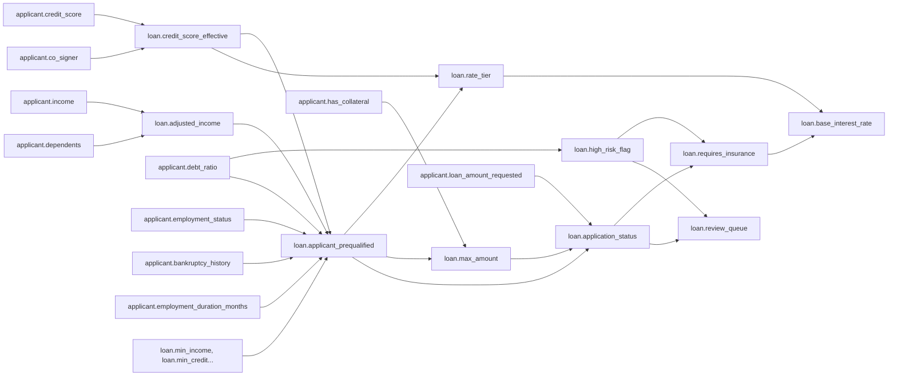
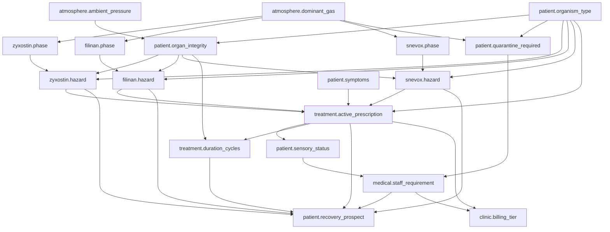
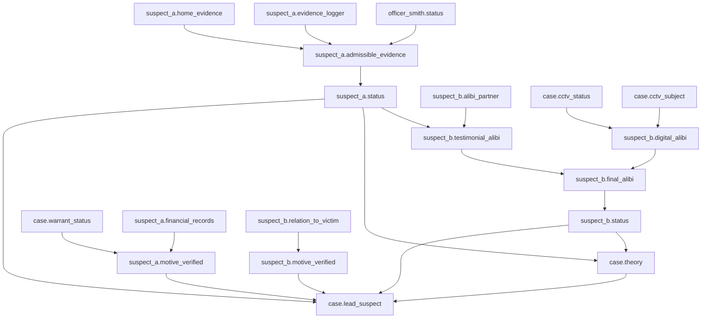
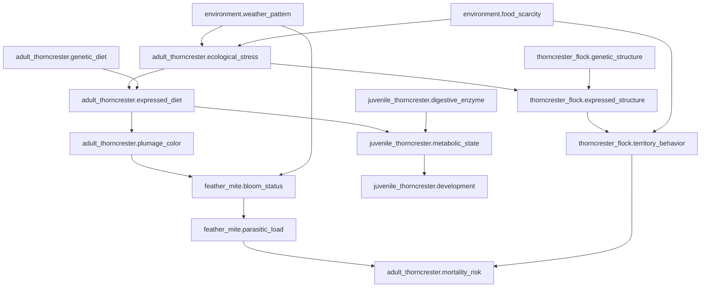

# Belief-Aware LLM — Domain Specifications

This document defines the four handcrafted domains used to evaluate the belief revision system. Each domain uses the KV store + dependency map representation (`entity.attribute = value`). Rules are deterministic `derive_fn` functions.

---

## Domain 1: Loan Eligibility

### Purpose

The **baseline domain**. Threshold-based rules with clear pass/fail outcomes. Validates core architecture: insert, conflict detection, dirty propagation, lazy resolution.

### What It Tests

| Capability                    | How                                                                                                                               |
| ----------------------------- | --------------------------------------------------------------------------------------------------------------------------------- |
| Basic contradiction detection | Income changes → old value conflicts with new                                                                                     |
| Multi-hop revision            | Income → adjusted_income → eligible → rate_tier (3 hops)                                                                          |
| Conjunctive rules             | Eligibility requires ALL conditions in one rule                                                                                   |
| Belief Maintain               | Changing credit score should NOT affect employment status                                                                         |
| Stage-gated decisions         | Distinguishing global eligibility (qualified applicant) from application-specific decisions (amount requested vs maximum allowed) |

### Attributes (KV Keys)

| Key                                    | Type    | Example                     | How It Evolves             |
| -------------------------------------- | ------- | --------------------------- | -------------------------- |
| `applicant.income`                     | numeric | 3000, 6000                  | Raises, job loss           |
| `applicant.credit_score`               | numeric | 520, 750                    | Payments, defaults         |
| `applicant.debt_ratio`                 | float   | 0.15, 0.60                  | New loans, payoffs         |
| `applicant.employment_status`          | str     | employed, unemployed        | Hiring, firing             |
| `applicant.employment_duration_months` | numeric | 3, 36                       | Time passing               |
| `applicant.has_collateral`             | bool    | true, false                 | Asset purchase/sale        |
| `applicant.loan_amount_requested`      | numeric | 10000, 50000                | Applicant changes          |
| `applicant.bankruptcy_history`         | bool    | true, false                 | Proceedings resolved       |
| `applicant.co_signer`                  | bool    | true, false                 | Co-signer agrees/withdraws |
| `applicant.dependents`                 | numeric | 0, 3                        | Family changes             |
| `loan.min_income`                      | numeric | 5000                        | Policy                     |
| `loan.min_credit`                      | numeric | 650                         | Policy                     |
| `loan.max_debt_ratio`                  | float   | 0.4                         | Policy                     |
| `loan.adjusted_income`                 | numeric | 2500, 5500                  | Formula changes            |
| `loan.requires_insurance`              | bool    | true, false                 | Risk profile               |
| `loan.review_queue`                    | str     | auto_approve, manual_review | Automation                 |
| `loan.base_interest_rate`              | float   | 4.5, 6.5                    | Rate tiers                 |

### Rules

All conditions are consolidated per output key — no rule priority conflicts.

```python
R1: loan.applicant_prequalified
    inputs: [loan.adjusted_income, loan.credit_score_effective, applicant.debt_ratio,
             applicant.employment_status, applicant.bankruptcy_history,
             applicant.employment_duration_months,
             loan.min_income, loan.min_credit, loan.max_debt_ratio]
    logic:
      IF employment_status = "unemployed" → False
      IF bankruptcy_history = True AND employment_duration_months < 24 → False
      IF adjusted_income >= min_income AND credit_score_effective >= min_credit AND debt_ratio < max_debt_ratio → True
      ELSE → False

R2: loan.credit_score_effective
    inputs: [applicant.credit_score, applicant.co_signer]
    logic:  credit_score + 50 if co_signer = True, else credit_score

#### R3: loan.rate_tier
    inputs: [loan.applicant_prequalified, loan.credit_score_effective]
    logic:
      IF NOT applicant_prequalified → None
      IF credit_score_effective >= 750 → "preferred"
      ELSE → "standard"

#### R4: loan.max_amount
    inputs: [loan.applicant_prequalified, applicant.has_collateral]
    logic:
      IF NOT applicant_prequalified → 0
      IF has_collateral → 100000
      ELSE → 30000

#### R5: loan.application_status
    inputs: [loan.applicant_prequalified, applicant.loan_amount_requested, loan.max_amount]
    logic:
      IF NOT applicant_prequalified → "denied_ineligible"
      IF loan_amount_requested > max_amount → "denied_amount_exceeded"
      ELSE → "approved"

R6: loan.high_risk_flag
    inputs: [applicant.debt_ratio]
    logic:  debt_ratio >= 0.3 → True, else False

R7: loan.adjusted_income
    inputs: [applicant.income, applicant.dependents]
    logic: income - (dependents * 500)

R8: loan.requires_insurance
    inputs: [loan.high_risk_flag, loan.application_status]
    logic: IF high_risk_flag = True AND application_status = "approved" → True, ELSE False

R9: loan.review_queue
    inputs: [loan.application_status, loan.high_risk_flag]
    logic:
      IF application_status = "approved" AND high_risk_flag = False → "auto_approve"
      IF application_status = "approved" AND high_risk_flag = True → "manual_review"
      ELSE → "rejected"

R10: loan.base_interest_rate
    inputs: [loan.rate_tier, loan.requires_insurance]
    logic:
      IF rate_tier is None → None
      base = 4.5 if rate_tier = "preferred" else 6.5
      return base + 1.0 if requires_insurance = True else base
```

### Dependency Chain



### Example Revision Scenario

```
t=0: applicant.income = 3000, applicant.dependents = 2, applicant.credit_score = 700, applicant.debt_ratio = 0.3
     → R7: 3000 - (2 * 500) → loan.adjusted_income = 2000
     → R1: 2000 < 5000 → loan.applicant_prequalified = False
     → R3: not eligible → loan.rate_tier = None
     → R5: → loan.application_status = "denied_ineligible"

t=1: applicant.income updated to 6000
     → dirty: {loan.applicant_prequalified, loan.rate_tier, loan.max_amount, loan.application_status}

t=2: resolve_all_dirty():
     → R7: 6000 - 1000 = 5000
     → R1: 5000 >= 5000 ✓, credit_score_effective=700 >= 650 ✓, 0.3 < 0.4 ✓ → loan.applicant_prequalified = True
     → R3: eligible, credit_score_effective=700 < 750 → loan.rate_tier = "standard"
     → R4: eligible, no collateral → loan.max_amount = 30000
     → R5: eligible, 10000 <= 30000 → loan.application_status = "approved"
```

---

## Domain 2: Alien Clinic

### Purpose

The **high-stakes safety domain**. It evaluates the system's ability to handle "Hard Stop" constraints where specific combinations of attributes result in catastrophic failure (lethal reactions). It tests the navigation of a prioritized fallback list and the recognition of non-lethal side effects when "Last Resort" protocols are triggered. The setting of this domain is an intergalactic clinic, providing treatments for various alien species.

### What It Tests

| Capability                  | How                                                                                   |
| --------------------------- | ------------------------------------------------------------------------------------- |
| **Zero Parametric Leakage** | Fictional species and compounds ensure no reliance on training data.                  |
| **Safety-First Retraction** | Retracting a primary treatment immediately when a "Lethal" pairing is identified.     |
| **Triangulated Dependency** | Atmosphere affects both the patient (integrity) and the treatment (phase).            |
| **Hierarchical Recovery**   | Navigating a preference order (Primary → Secondary → Tertiary) based on safety flags. |
| **Side-Effect Propagation** | Updating patient state (e.g., sensory status) when forced to use fallback options.    |

### Attributes (KV Keys)

| Key                             | Type      | Example                                  | How It Evolves                    |
| ------------------------------- | --------- | ---------------------------------------- | --------------------------------- |
| `patient.organism_type`         | str       | Glerps, Yorp, Qwerl                      | Genetic identification            |
| `patient.symptoms`              | list[str] | ["fever", "spasms"]                      | Tracks active biological symptoms |
| `patient.organ_integrity`       | str       | stable, brittle, volatile                | Derived from pressure (R1)        |
| `patient.sensory_status`        | str       | normal, telepathic                       | Derived from side effects (R5)    |
| `atmosphere.ambient_pressure`   | numeric   | 0.8, 4.5                                 | Environmental sensors             |
| `atmosphere.dominant_gas`       | str       | chlorine, methane, xenon                 | Environmental sensors             |
| `treatment.active_prescription` | str       | zyxostin, filinan, snevox, none          | Derived selection (R4)            |
| `zyxostin.phase`                | str       | crystalline, plasma                      | Derived from gas (R2)             |
| `filinan.phase`                 | str       | vapor, plasma                            | Derived from gas (R2)             |
| `snevox.phase`                  | str       | liquid, vapor                            | Derived from gas (R2)             |
| `zyxostin.hazard`               | str       | safe, LETHAL, symbiotic                  | Safety check for zyxostin         |
| `filinan.hazard`                | str       | safe, LETHAL, symbiotic                  | Safety check for filinan          |
| `snevox.hazard`                 | str       | safe, LETHAL, symbiotic                  | Safety check for snevox           |
| `patient.quarantine_required`   | bool      | True, False                              | Derived (R6)                      |
| `treatment.duration_cycles`     | numeric   | 5, 12, 0                                 | Derived (R7)                      |
| `medical.staff_requirement`     | str       | hazmat_team, psionic_handler             | Derived (R8)                      |
| `patient.recovery_prospect`     | str       | excellent, guarded, terminal, miraculous | Derived (R9)                      |
| `clinic.billing_tier`           | str       | class_standard, class_omega              | Derived (R10)                     |

### Rules

```yaml
R1: patient.organ_integrity
  inputs: [atmosphere.ambient_pressure, patient.organism_type]
  logic: |
    IF ambient_pressure > 5.0 AND organism_type == "Yorp" → "volatile"
    IF ambient_pressure > 4.0 AND organism_type == "Glerps" → "volatile"
    IF ambient_pressure > 3.0 → "brittle"
    ELSE → "stable"

R2: {compound}.phase (Calculated 3x: for zyxostin, filinan, snevox)
  inputs: [atmosphere.dominant_gas]
  logic: |
    # Evaluate for `zyxostin.phase`:
    IF dominant_gas == "methane" → "plasma", ELSE → "crystalline"
    # Evaluate for `filinan.phase`:
    IF dominant_gas == "xenon" → "vapor", ELSE → "plasma"
    # Evaluate for `snevox.phase`:
    IF dominant_gas == "chlorine" → "liquid", ELSE → "vapor"

R3: {compound}.hazard (Calculated 3x: for zyxostin, filinan, snevox)
  inputs: [patient.organism_type, {compound}.phase, patient.organ_integrity]
  logic: |
    # Evaluate for a given `compound` (e.g. zyxostin):
    # 1. EXPLODE CONSTRAINTS & SINGULARITY
    # Paradox: If an organism has "volatile" organ integrity AND takes a compound that normally triggers an
    # explode constraint, the catastrophic biological forces cancel out resulting in a "symbiotic" singularity.
    IF (organism_type == "Glerps" AND compound == "zyxostin") OR
       (organism_type == "Yorp" AND compound == "filinan") OR
       (organism_type == "Qwerl" AND compound == "snevox"):
       IF organ_integrity == "volatile" → "symbiotic"
       ELSE → "LETHAL"

    # 2. State-Based
    IF {compound}.phase == "plasma" AND compound == "filinan" → "LETHAL"
    IF {compound}.phase == "vapor" AND compound == "snevox" AND organism_type == "Qwerl" → "LETHAL"

    # 3. Condition-Based
    IF organ_integrity == "volatile" → "LETHAL"
    ELSE → "safe"

R4: treatment.active_prescription
  inputs: [patient.organism_type, patient.symptoms, zyxostin.hazard, filinan.hazard, snevox.hazard]
  logic: |
    # 1. MIRACLE OVERRIDE
    # If ANY compound evaluates to "symbiotic", it completely overrides symptom priority lists and is selected.
    IF ANY compound.hazard == "symbiotic" → return that compound (if multiple, pick first in standard priority)

    # 2. SYMPTOM PRIORITIES
    # Treatments are evaluated in priority order based on the organism and subset of strings in `patient.symptoms`:
    IF organism_type == "Glerps":
      IF "fever" IN symptoms AND "spasms" IN symptoms → snevox → zyxostin → filinan
      ELSE IF "fever" IN symptoms → zyxostin → snevox → filinan
      ELSE → Priority: filinan → zyxostin → snevox
    IF organism_type == "Yorp":
      IF "acid_sweat" IN symptoms → filinan → snevox → zyxostin
      ELSE → Priority: zyxostin → snevox → filinan
    IF organism_type == "Qwerl":
      Priority: snevox → zyxostin → filinan

    # Select the highest-priority compound that evaluates to "safe".
    # If none are safe (and none symbiotic), return "none".

R5: patient.sensory_status
  inputs: [treatment.active_prescription]
  logic: |
    IF active_prescription == "snevox" → "telepathic"
    ELSE → "normal"

R6: patient.quarantine_required
  inputs: [atmosphere.dominant_gas, patient.organism_type]
  logic: |
    IF dominant_gas == "chlorine" AND organism_type == "Qwerl" → True
    IF dominant_gas == "methane" AND organism_type == "Yorp" → True
    ELSE → False

R7: treatment.duration_cycles
  inputs: [treatment.active_prescription, patient.organ_integrity]
  logic: |
    IF active_prescription == "snevox" AND organ_integrity == "volatile" → 12
    IF active_prescription == "none" → 0
    ELSE → 5

R8: medical.staff_requirement
  inputs: [patient.quarantine_required, patient.sensory_status]
  logic: |
    IF quarantine_required == True → "hazmat_team"
    IF sensory_status == "telepathic" → "psionic_handler"
    ELSE → "standard_medic"

R9: patient.recovery_prospect
  inputs: [treatment.active_prescription, zyxostin.hazard, filinan.hazard, snevox.hazard, treatment.duration_cycles, medical.staff_requirement]
  logic: |
    # 1. MIRACLE CHECK: If active prescription was explicitly chosen due to a "symbiotic" hazard state
    IF active_prescription hazard == "symbiotic" → "miraculous"

    # 2. STANDARD CHECK
    IF duration_cycles > 10 AND staff_requirement == "hazmat_team" → "guarded"
    IF duration_cycles == 0 → "terminal"
    ELSE → "excellent"

R10: clinic.billing_tier
  inputs: [treatment.active_prescription, medical.staff_requirement]
  logic: |
    IF staff_requirement == "psionic_handler" OR active_prescription == "snevox" → "class_omega"
    IF staff_requirement == "hazmat_team" → "class_delta"
    ELSE → "class_standard"
```

### Dependency Chain



### Example Revision Scenario

```yaml
t=0: organism_type = "Glerps", symptoms = [], ambient_pressure = 3.5, dominant_gas = "methane"
     → R1: 3.5 > 3.0 AND 3.5 <= 4.0 → organ_integrity = "brittle"
     → R2: methane → zyxostin.phase = "plasma", filinan.phase = "plasma", snevox.phase = "vapor"
     → R3: (zyxostin hazard) Glerps + zyxostin = LETHAL (no singularity since state is brittle)
     → R3: (filinan hazard) phase=plasma + filinan = LETHAL
     → R3: (snevox hazard) safe (vapor is safe for Glerps)
     → R4: Glerps logic (Prefers filinan → zyxostin → snevox). Top two are Lethal.
          → active_prescription = "snevox"
     → R5: active_prescription is snevox → sensory_status = "telepathic"
     → R8: sensory_status is telepathic → staff_requirement = "psionic_handler"
     → R10: billing_tier = "class_omega"

t=1: Inject Symptoms! symptoms = ["fever", "spasms"]
     → dirty: {active_prescription, sensory_status, staff_requirement, recovery_prospect, billing_tier, duration_cycles}
     → resolve_all_dirty():
       R4: Glerps w/ fever & spasms priority changes to: snevox → zyxostin → filinan.
           snevox is safe, so active_prescription REMAINS "snevox".
           Most downstream states remain clean! "Invisible shift".

t=2: Pressure spike! ambient_pressure = 4.5
     → dirty: {organ_integrity, zyxostin.hazard, filinan.hazard, snevox.hazard, active_prescription ...}
     → resolve_all_dirty():
       R1: > 4.0 + Glerps → organ_integrity = "volatile"
       R3: Singularity! Glerps + zyxostin + volatile = "symbiotic".
           Other compounds without explode constraints: filinan=LETHAL, snevox=LETHAL.
       R4: Symbiotic override! active_prescription = "zyxostin".
       R5: active_prescription is zyxostin → sensory_status = "normal"
       R7: active_prescription is zyxostin → duration_cycles = 5
       R8: sensory_status normal, no quarantine → staff_requirement = "standard_medic"
       R9: active_prescription hazard is "symbiotic" → recovery_prospect = "miraculous"
       R10: standard_medic → billing_tier = "class_standard"
```

## Domain 3: Crime Scene Investigation (Relational & Epistemic)

### Attributes (KV Keys)

| Key                             | Type | Example                          | Semantic Role                                    |
| ------------------------------- | ---- | -------------------------------- | ------------------------------------------------ |
| `officer_smith.status`          | str  | "active", "suspended"            | The procedural integrity flag.                   |
| `case.warrant_status`           | bool | true, false                      | Legal permission for financial records.          |
| `case.cctv_status`              | str  | "active", "corrupted"            | Digital evidence integrity.                      |
| `case.cctv_subject`             | str  | "suspect_b", "none"              | Who the camera saw.                              |
| `suspect_a.home_evidence`       | str  | "gun", "none"                    | Physical reality.                                |
| `suspect_a.evidence_logger`     | str  | "officer_smith", "none"          | Custody chain link.                              |
| `suspect_a.financial_records`   | str  | "debt", "clean"                  | Potential motive source.                         |
| `suspect_b.relation_to_victim`  | str  | "enemy", "stranger"              | Potential motive source.                         |
| `suspect_b.alibi_partner`       | str  | "suspect_a", "none"              | Relational link.                                 |
| `suspect_a.admissible_evidence` | str  | "gun", "none"                    | **Derived:** Legally usable physical evidence.   |
| `suspect_b.testimonial_alibi`   | str  | "confirmed", "broken"            | **Derived:** Epistemic health of human alibi.    |
| `suspect_b.digital_alibi`       | str  | "confirmed", "none"              | **Derived:** Epistemic health of digital alibi.  |
| `suspect_b.final_alibi`         | str  | "confirmed", "broken"            | **Derived:** Reconciled alibi state.             |
| `suspect_a.motive_verified`     | bool | true, false                      | **Derived:** Legally admissible motive.          |
| `suspect_b.motive_verified`     | bool | true, false                      | **Derived:** Socially established motive.        |
| `suspect_a.status`              | str  | "prime_suspect", "cleared"       | **Derived:** A's current legal standing.         |
| `suspect_b.status`              | str  | "prime_suspect", "cleared"       | **Derived:** B's current legal standing.         |
| `case.theory`                   | str  | "collusion", "solo_perpetrator"  | **Derived:** Abductive conclusion.               |
| `case.lead_suspect`             | str  | "suspect_a", "suspect_b", "none" | **Derived:** Final target based on tie-breakers. |

### Rules (Deterministic `derive_fn`)

```python
# --- BLOCK 1: PHYSICAL EVIDENCE & BASE STATUS ---

R1: suspect_a.admissible_evidence
    inputs: [suspect_a.home_evidence, suspect_a.evidence_logger, officer_smith.status]
    logic:
      IF evidence_logger = "officer_smith" AND officer_smith.status = "suspended" → "none"
      ELSE → home_evidence

R2: suspect_a.status
    inputs: [suspect_a.admissible_evidence]
    logic:
      IF admissible_evidence != "none" → "prime_suspect"
      ELSE → "cleared"


# --- BLOCK 2: ALIBI HIERARCHY (Testimonial vs. Digital) ---

R3: suspect_b.testimonial_alibi
    inputs: [suspect_b.alibi_partner, suspect_a.status]
    logic:
      IF alibi_partner = "suspect_a" AND suspect_a.status = "prime_suspect" → "broken"
      ELSE → "confirmed"

R4: suspect_b.digital_alibi
    inputs: [case.cctv_status, case.cctv_subject]
    logic:
      IF cctv_status = "active" AND cctv_subject = "suspect_b" → "confirmed"
      ELSE → "none"

R5: suspect_b.final_alibi
    inputs: [suspect_b.testimonial_alibi, suspect_b.digital_alibi]
    logic:
      # Digital evidence overrides a broken human alibi
      IF digital_alibi = "confirmed" → "confirmed"
      ELSE → testimonial_alibi

R6: suspect_b.status
    inputs: [suspect_b.final_alibi]
    logic:
      IF final_alibi = "broken" → "prime_suspect"
      ELSE → "cleared"


# --- BLOCK 3: MOTIVE & GATEKEEPING ---

R7: suspect_a.motive_verified
    inputs: [suspect_a.financial_records, case.warrant_status]
    logic:
      # A second procedural gate: No warrant = no financial motive
      IF financial_records = "debt" AND warrant_status = True → True
      ELSE → False

R8: suspect_b.motive_verified
    inputs: [suspect_b.relation_to_victim]
    logic:
      IF relation_to_victim = "enemy" → True
      ELSE → False


# --- BLOCK 4: ABDUCTIVE CONCLUSIONS ---

R9: case.theory
    inputs: [suspect_a.status, suspect_b.status]
    logic:
      IF suspect_a.status = "prime_suspect" AND suspect_b.status = "prime_suspect" → "collusion"
      IF suspect_a.status = "prime_suspect" OR suspect_b.status = "prime_suspect" → "solo_perpetrator"
      ELSE → "unsolved"

R10: case.lead_suspect
    inputs: [case.theory, suspect_a.status, suspect_b.status, suspect_a.motive_verified, suspect_b.motive_verified]
    logic:
      IF theory = "unsolved" → "none"
      IF theory = "solo_perpetrator" AND suspect_a.status = "prime_suspect" → "suspect_a"
      IF theory = "solo_perpetrator" AND suspect_b.status = "prime_suspect" → "suspect_b"
      # Tie-breaker for collusion: The Mastermind is the one with the verified motive
      IF theory = "collusion":
          IF suspect_a.motive_verified = True AND suspect_b.motive_verified = False → "suspect_a"
          IF suspect_b.motive_verified = True AND suspect_a.motive_verified = False → "suspect_b"
          ELSE → "both"
```

### Dependency Chain



---

## Domain 4: Thorncrester Taxonomy (Ecological Masking)

### Purpose

Tests belief revision with **complete parametric isolation** using a fictional species. Crucially, it evaluates **non-monotonic inheritance** and **latent beliefs**. It tests whether the system can distinguish between a permanent underlying trait (genotype) and a temporary environmental adaptation (phenotype), and successfully "unmask" the default trait when ecological pressures lift.

### What It Tests

| Capability                    | How                                                                                                           |
| ----------------------------- | ------------------------------------------------------------------------------------------------------------- |
| **Parametric Isolation**      | Fictional species ensures zero reliance on the LLM's pre-trained weights.                                     |
| **Ontological Masking**       | An environmental stressor forces the observable `expressed_diet` to deviate from the `genetic_diet`.          |
| **Latent Belief Maintenance** | The system must remember the underlying genetic defaults even while reasoning over the temporary adaptations. |
| **Ecosystem Cascades**        | Reverting a single weather parameter ripples through diet, mating, and conservation protocols.                |

### Attributes (KV Keys)

| Key | Type | Example | Semantic Role |
| -------------------------------------- | ---- | ---------------------- | ------------------------------------------ |
| `environment.weather_pattern`          | str  | "stable", "drought"    | The external trigger.                      |
| `environment.food_scarcity`            | bool | true, false            | Secondary environmental state.             |
| `adult_thorncrester.genetic_diet`      | str  | "frugivore"            | Latent: Unchangeable base adult trait.     |
| `thorncrester_flock.genetic_structure` | str  | "matriarchal_pairs"    | Latent: Unchangeable base social trait.    |
| `juvenile_thorncrester.digestive_enzyme`| str  | "fructose_processor"   | Latent: Unchangeable base offspring trait. |
| `adult_thorncrester.ecological_stress` | str  | "high", "nominal"      | Derived: The masking trigger.              |
| `adult_thorncrester.expressed_diet`    | str  | "frugivore", "scavenger"| Derived: Observable phenotype.             |
| `adult_thorncrester.plumage_color`     | str  | "crimson", "dull_grey" | Derived: Physical state.                   |
| `thorncrester_flock.expressed_structure`| str  | "matriarchal_pairs", "survival_swarm"| Derived: Masked social phenotype.          |
| `thorncrester_flock.territory_behavior`| str  | "peaceful", "hyper_aggressive"| Derived: Flock action.                     |
| `juvenile_thorncrester.metabolic_state`| str  | "thriving", "starving" | Derived: Biological match/mismatch.        |
| `juvenile_thorncrester.development`    | str  | "maturing", "arrested" | Derived: Growth status.                    |
| `feather_mite.bloom_status`            | str  | "dormant", "active_bloom"| Derived: Parasite activation.              |
| `feather_mite.parasitic_load`          | str  | "harmless", "lethal"   | Derived: Parasite danger level.            |
| `adult_thorncrester.mortality_risk`    | str  | "low", "critical"      | Derived: Final biological outcome.         |

### Rules

```python
# --- BLOCK 1: THE ADULT MASKING LAYER ---

R1: adult_thorncrester.ecological_stress
    inputs: [environment.weather_pattern, environment.food_scarcity]
    logic:
      IF weather_pattern = "drought" AND food_scarcity = True → "high"
      ELSE → "nominal"

R2: adult_thorncrester.expressed_diet
    inputs: [adult_thorncrester.genetic_diet, adult_thorncrester.ecological_stress]
    logic:
      # Masking: High stress overrides the genetic diet
      IF ecological_stress = "high" → "scavenger"
      ELSE → genetic_diet

R3: adult_thorncrester.plumage_color
    inputs: [adult_thorncrester.expressed_diet]
    logic:
      IF expressed_diet = "scavenger" → "dull_grey"
      ELSE → "crimson"


# --- BLOCK 2: THE MACRO-SOCIAL MASKING LAYER ---

R4: thorncrester_flock.expressed_structure
    inputs: [thorncrester_flock.genetic_structure, adult_thorncrester.ecological_stress]
    logic:
      # Masking: High stress overrides natural matriarchal pairing
      IF ecological_stress = "high" → "survival_swarm"
      ELSE → genetic_structure

R5: thorncrester_flock.territory_behavior
    inputs: [thorncrester_flock.expressed_structure, environment.food_scarcity]
    logic:
      IF expressed_structure = "survival_swarm" AND food_scarcity = True → "hyper_aggressive"
      ELSE → "peaceful"


# --- BLOCK 3: THE JUVENILE DEPENDENCY TRAP ---

R6: juvenile_thorncrester.metabolic_state
    inputs: [juvenile_thorncrester.digestive_enzyme, adult_thorncrester.expressed_diet]
    logic:
      # The biological mismatch trap: Adults feed the young what they eat. 
      # If adult eats meat, but young only digest fruit, the young starve.
      IF digestive_enzyme = "fructose_processor" AND expressed_diet != "frugivore" → "starving"
      ELSE → "thriving"

R7: juvenile_thorncrester.development
    inputs: [juvenile_thorncrester.metabolic_state]
    logic:
      IF metabolic_state = "starving" → "arrested"
      ELSE → "maturing"


# --- BLOCK 4: THE PARASITIC LAYER ---

R8: feather_mite.bloom_status
    inputs: [adult_thorncrester.plumage_color, environment.weather_pattern]
    logic:
      # Mites specifically thrive in the dull_grey stress plumage during droughts
      IF plumage_color = "dull_grey" AND weather_pattern = "drought" → "active_bloom"
      ELSE → "dormant"

R9: feather_mite.parasitic_load
    inputs: [feather_mite.bloom_status]
    logic:
      IF bloom_status = "active_bloom" → "lethal"
      ELSE → "harmless"


# --- BLOCK 5: THE FINAL OUTCOME ---

R10: adult_thorncrester.mortality_risk
    inputs: [feather_mite.parasitic_load, thorncrester_flock.territory_behavior]
    logic:
      # Death occurs if parasites are lethal OR if the flock is tearing itself apart
      IF parasitic_load = "lethal" OR territory_behavior = "hyper_aggressive" → "critical"
      ELSE → "low"
```

### Dependency Chain



> [!NOTE]
> Example walkthrough for this domain is currently being updated to reflect the new 10-rule hierarchy.

---

## Cross-Domain Comparison

| Property                 | Loan                  | Alien Clinic        | Crime Scene             | Thorncrester         |
| ------------------------ | --------------------- | ------------------- | ----------------------- | -------------------- |
| **Max dependency depth** | 3 hops                | 3 hops              | 7 hops                  | 5 hops               |
| **Number of rules**      | 10                    | 10                  | 10                      | 10                   |
| **Number of attributes** | 17                    | 18                  | 19                      | 15                   |
| **Parametric isolation** | Low                   | Medium              | **Complete**            | **Complete**         |
| **Belief Maintain test** | ✓ credit ↛ employment | ✓ organ ↛ pressure  | ✓ suspect_a ↛ suspect_b | ✓ expressed ↛ latent |
| **Key revision pattern** | Algorithmic Status    | Counterfactual      | Epistemic Gatekeeping   | Ecosystem Trap       |
