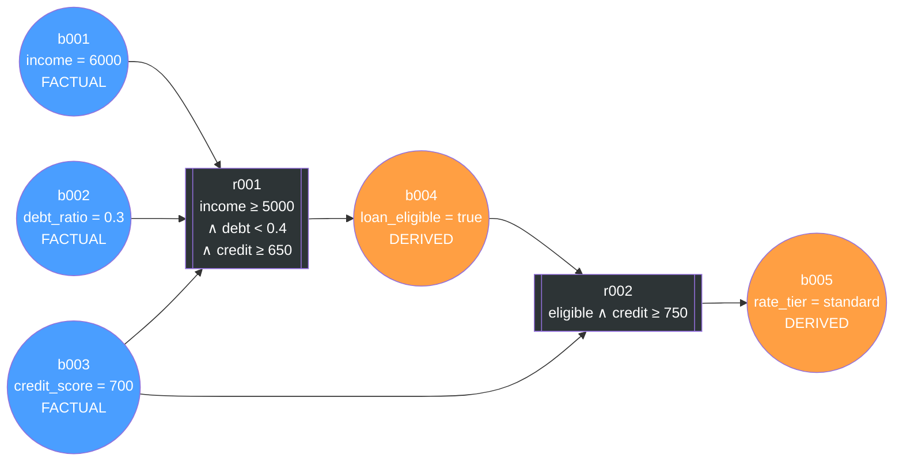
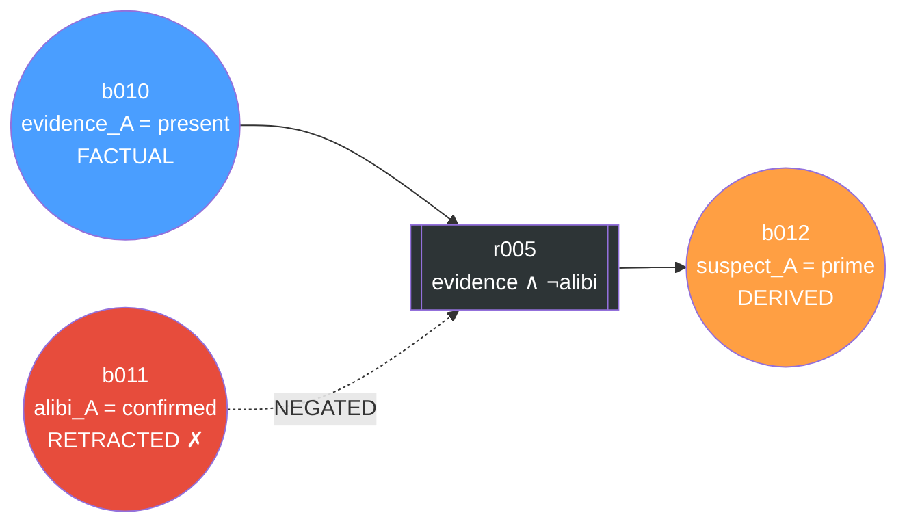
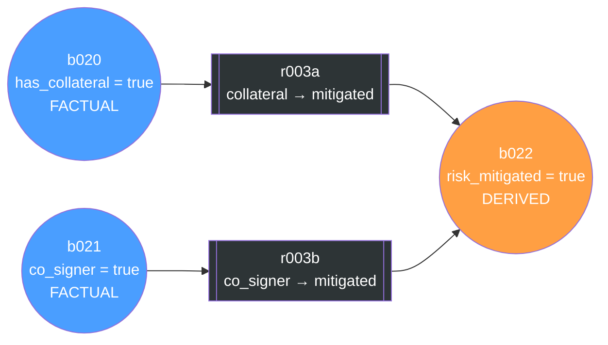
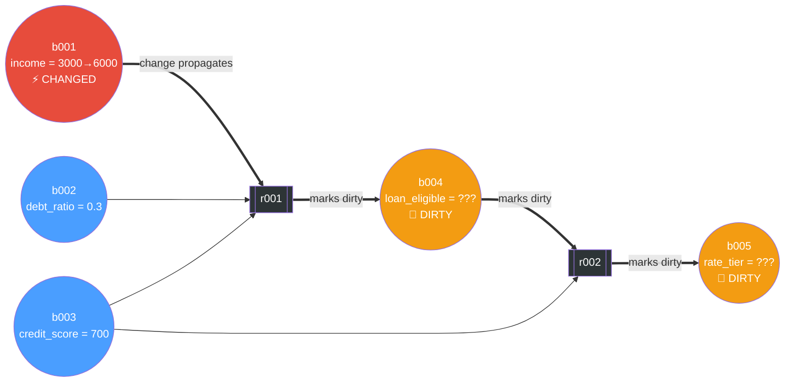
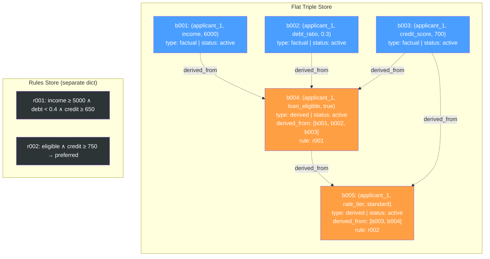
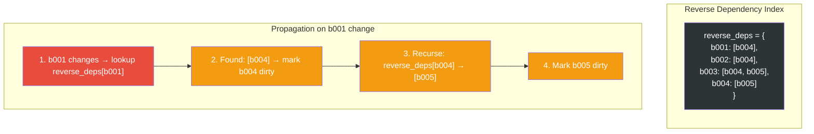

# Graph Structure Debate: Bipartite Inference Graph vs. KG Triples

## The Question

How should the belief store be structured? Two viable options emerged:

1. **Bipartite Inference Graph** — two node types (beliefs + rules) in a directed graph, where edges represent entailment
2. **KG Triples with Dependency Metadata** — flat `(Subject, Relation, Object)` triples with `derived_from` and `derivation_rule` fields

Both support the same revision behavior (contradiction detection, dirty propagation, lazy re-derivation). The difference is structural.

---

## Option A: Bipartite Inference Graph

Rules are **explicit nodes** in the graph. Edges alternate: `belief → rule → belief`.

### Visualization (Loan Domain)

### With Negation (Crime Domain)

### With Disjunction (Loan Domain)

### Dirty Propagation

---

## Option B: KG Triples with Dependency Metadata

Rules are **metadata on derived triples**, not graph nodes. The store is a flat dictionary of triples.

### Visualization (Loan Domain)

### Dirty Propagation (via reverse index)

---

## Side-by-Side Comparison

| Aspect | Bipartite Graph | KG Triples + derived_from |
|---|---|---|
| **Data structure** | NetworkX directed graph | Dict of triples + dict of rules |
| **Nodes** | Beliefs + Rules (2 types) | Beliefs only |
| **Where rules live** | Explicit graph nodes | Metadata on derived triples + separate rules dict |
| **Conjunction** | Multiple edges into a rule node | `derived_from: [b001, b002, b003]` |
| **Disjunction** | Multiple rule nodes → same belief | Multiple rules listed, check if any fires |
| **Negation** | `negated` flag on edge | `negated_premises: [b011]` in metadata |
| **Dirty propagation** | BFS on graph edges | Reverse index lookup + recursion |
| **Forward traversal** | Follow edges naturally | Requires building reverse index |
| **Backward traversal** | Follow edges in reverse | Direct — `derived_from` field |
| **Serialization** | Walk graph, format nodes/edges | Dump relevant triples as text |
| **Code complexity** | ~400+ lines | ~200 lines |
| **Bipartite invariant** | Must enforce (no belief→belief) | Not applicable |
| **Academic framing** | Inference graph / TMS (stronger) | Knowledge base with dependency tracking |
| **Implementation speed** | Slower | Faster |
| **Revision behavior** | Identical | Identical |

## The Decision Criterion

> **If your professor requires entailment-as-edges** (the graph structure itself is a deliverable) → **Bipartite Graph**
>
> **If your professor cares about revision behavior** (contradiction detection, dirty propagation, lazy re-derivation) → **KG Triples** (faster to build, same behavior)
>
> Ask: *"Is the graph structure itself a deliverable, or is the revision behavior what matters?"*
